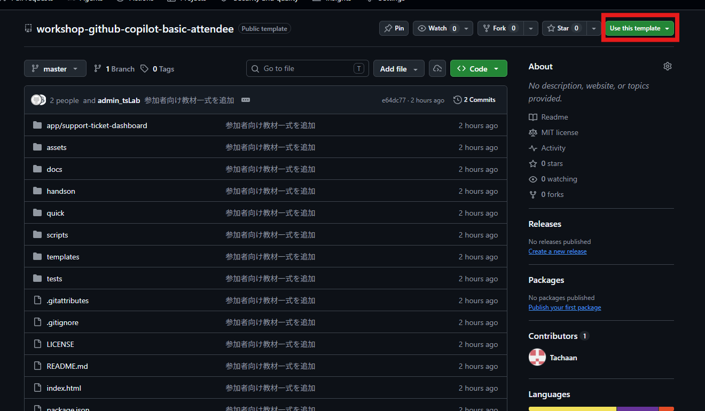
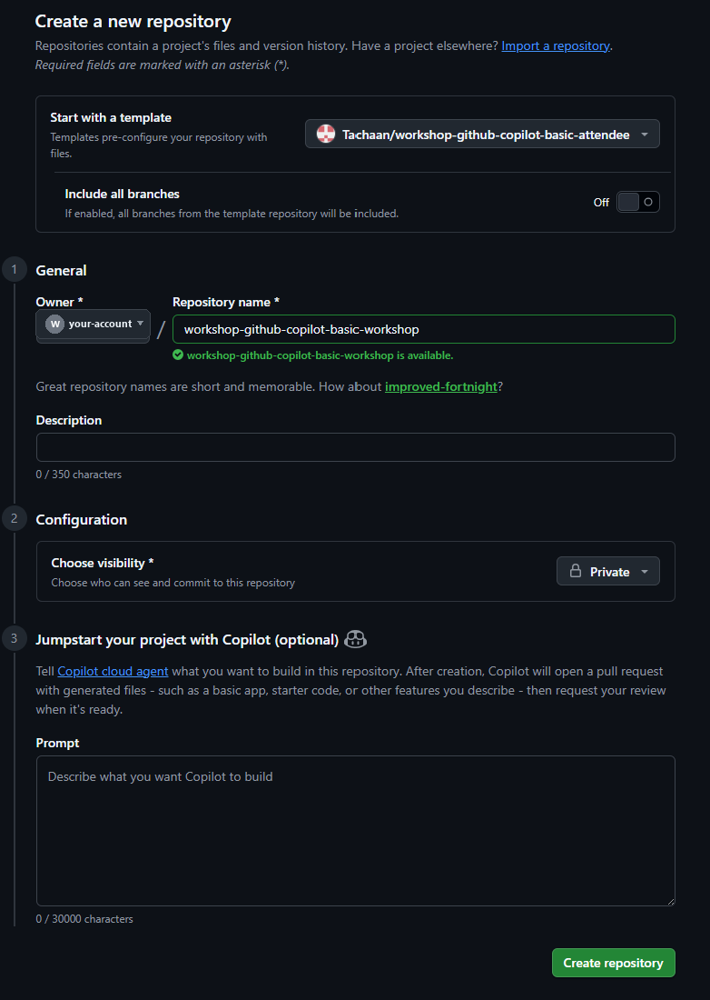

# 受講前準備: 演習用リポジトリを作成する

**所要時間の目安: 5分（Workshop開始前）**

このページでは、公開テンプレート
[`Tachaan/workshop-github-copilot-basic-attendee`](https://github.com/Tachaan/workshop-github-copilot-basic-attendee)
から、受講に使うGitHubアカウントのOwner配下へ演習用リポジトリを作成し、ローカルへcloneします。

> [!IMPORTANT]
> テンプレートのOwnerは`Tachaan`ですが、新しく作るリポジトリのOwnerには**受講に使う自分の個人アカウント**を選択します。Organizationへの作成やOrganizationからのCopilot割り当ては、このWorkshopでは必要ありません。

## 事前確認

- [ ] 受講に使うGitHubアカウントでブラウザーへサインインしている
- [ ] ローカル環境でGit、VS Code、Node.js 20.12.0以上、npmを利用できる
- [ ] 同じOwner配下に同名のリポジトリがない

## 1. 公開テンプレートを開く

1. [`Tachaan/workshop-github-copilot-basic-attendee`](https://github.com/Tachaan/workshop-github-copilot-basic-attendee)を開きます。
2. リポジトリ名の横に**Public template**と表示されていることを確認します。
3. **Use this template**を選択します。
4. 表示されたメニューから**Create a new repository**を選択します。



> [!TIP]
> **Use this template**が表示されない場合は、上記のURLを開いていることと、GitHubへサインインしていることを確認します。

## 2. 自分のOwner配下へ作成する

**Create a new repository**画面で、次のように設定します。

| 項目 | 設定 |
| --- | --- |
| Start with a template | `Tachaan/workshop-github-copilot-basic-attendee` |
| Include all branches | Offのまま |
| Owner | 受講に使う自分の個人アカウント |
| Repository name | 例: `workshop-github-copilot-basic-workshop` |
| Description | 任意 |
| Choose visibility | **Private**を推奨。公開してよい場合だけPublicを選択 |
| Jumpstart your project with Copilot | **何も入力せず空欄のまま** |



リポジトリ名の下に緑色で`is available`と表示されたら、画面下部の**Create repository**を選択します。

> [!CAUTION]
> **Jumpstart your project with Copilot**へ入力すると、作成直後に別のファイルやPull Requestが生成されることがあります。Workshopの初期状態を保つため、この欄は空欄にします。

## 3. 作成先を確認する

作成後に表示されたリポジトリで、次を確認します。

- URLが`https://github.com/<自分のアカウント>/<リポジトリ名>`になっている
- ページ上部のOwnerが自分の個人アカウントになっている
- `app`、`assets`、`docs`、`handson`、`quick`などのフォルダーが表示される
- 予期しないPull Requestや生成ファイルが追加されていない

Ownerが`Tachaan`のままに見える場合は、テンプレート側のページを見ています。自分のアカウント名を含む新しいURLへ移動してください。

## 4. ローカルへcloneする

新しく作成したリポジトリで**Code**を選択し、HTTPSのURLをコピーします。ターミナルで、自分のURLとフォルダー名へ置き換えて実行します。

```bash
git clone https://github.com/<自分のアカウント>/<リポジトリ名>.git
cd <リポジトリ名>
code .
```

VS Codeのターミナルで作成先と初期状態を確認します。

```bash
git remote -v
git status --short
npm test
```

`origin`が自分のアカウント配下を指し、`git status --short`に変更がなく、テストがすべて成功すれば準備完了です。

## うまくいかない場合

| 状況 | 確認すること |
| --- | --- |
| **Use this template**が見つからない | 指定のテンプレートURLとGitHubへのサインイン状態を確認する |
| 自分のOwnerを選べない | 受講に使う個人アカウントでサインインし直す |
| リポジトリ名を利用できない | 末尾に自分の名前や番号を付け、Owner配下で一意の名前にする |
| **Create repository**を選べない | Owner、Repository name、visibilityの必須項目を確認する |
| 間違ったOwnerへ作成した | そのリポジトリでは演習を始めず、自分の個人Ownerを選んで作成し直す |
| clone時に認証を求められる | ブラウザーと同じGitHubアカウントでGitの認証を完了する |
| `node`または`npm`が見つからない | Node.js 20.12.0以上をインストールし、ターミナルを開き直す |

## 完了条件

- [ ] 指定の公開テンプレートからリポジトリを作成した
- [ ] 新しいリポジトリのOwnerが受講に使う自分の個人アカウントになっている
- [ ] CopilotのJumpstart欄を使わず、テンプレートの初期状態を保っている
- [ ] ローカルへcloneし、VS Codeで開いた
- [ ] `origin`と`npm test`を確認した
