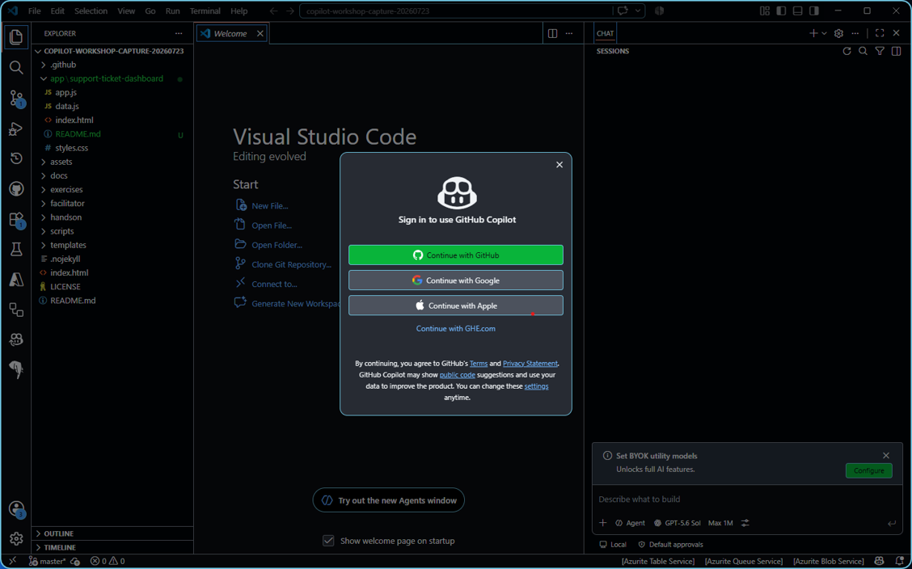
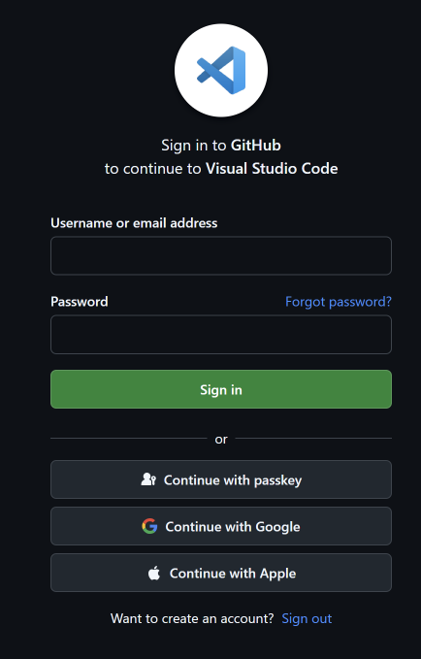
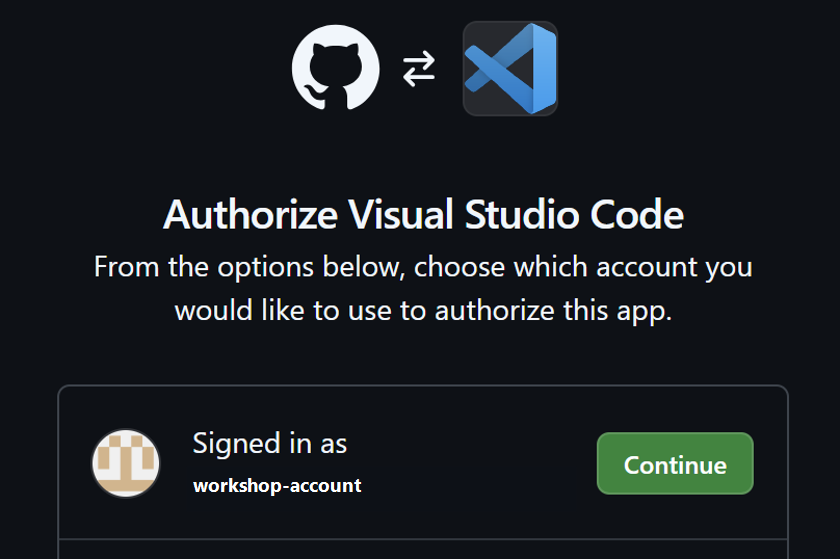
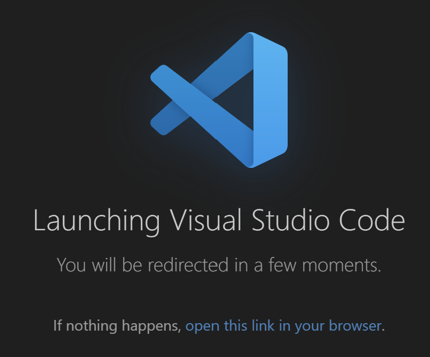

# 受講前準備: VS CodeでGitHub Copilotへサインイン

**所要時間の目安: 5分（Workshop開始前）**

このページでは、受講に使うGitHubアカウントをVisual Studio Codeへ接続し、GitHub Copilot Chatを利用できる状態にします。すでにサインイン済みの場合も、最後の確認まで実施してください。

> [!IMPORTANT]
> GitHub Copilot Chatを利用できるプランが有効なアカウントでサインインします。ブラウザーとVS Codeで別のGitHubアカウントを使わないでください。

## 事前確認

- [ ] 受講に使うGitHubアカウントへブラウザーでサインインできる
- [ ] そのアカウントでGitHub Copilot Chatを利用できる
- [ ] VS CodeでGitHub Copilot拡張機能が有効になっている
- [ ] ブラウザーからVS Codeを開く確認画面を操作できる

## 1. Copilotのサインイン画面を開く

1. VS Codeを開きます。この時点では演習用リポジトリを開いていなくても構いません。
2. 画面右下のステータスバーにある**Copilotマーク**を選択します。
3. **Continue with GitHub**を選択します。



> [!TIP]
> ステータスバーが表示されていない場合は、`Ctrl + Shift + P`でコマンドパレットを開き、`View: Toggle Status Bar Visibility`を実行します。

## 2. ブラウザーでGitHubへサインインする

ブラウザーが開いたら、受講に使うGitHubアカウントでサインインします。ユーザー名とパスワード、パスキーなど、普段使っている認証方法を選択してください。



> [!CAUTION]
> 共有PCでは認証情報を保存しません。別のアカウントが表示された場合は、そのまま進めず、受講に使うアカウントへ切り替えます。

## 3. Visual Studio CodeをAuthorizeする

1. **Authorize Visual Studio Code**画面で、表示されているGitHubアカウントを確認します。
2. 受講に使うアカウントであることを確認して、**Continue**を選択します。



アカウントが違う場合は、ブラウザーのGitHubからサインアウトし、正しいアカウントで手順をやり直します。

## 4. VS Codeへ戻る

**Launching Visual Studio Code**と表示されたら、ブラウザーからVS Codeを開く操作を許可します。



自動的に戻らない場合は、画面内の**open this link in your browser**を選択します。ブラウザーからアプリを開く確認が表示されたら、Visual Studio Codeを選択してください。

## 5. Copilot Chatで確認する

1. VS Codeへ戻り、Copilot Chatを開きます。
2. サインイン要求や利用権限エラーが表示されていないことを確認します。
3. 次の質問を送り、応答を受け取れることを確認します。

```text
GitHub Copilotを使うとき、人が確認すべきことを3つだけ教えてください。
```

応答が返ればサインイン完了です。回答内容はこの時点では採用せず、Copilot Chatへ入力して応答を受け取れることだけを確認します。

## うまくいかない場合

| 状況 | 確認すること |
| --- | --- |
| Copilotマークが見つからない | ステータスバーを表示し、GitHub Copilot拡張機能が有効か確認する |
| ブラウザーが開かない | Copilotマークをもう一度選択するか、コマンドパレットから`GitHub: Sign in`を実行する |
| 違うGitHubアカウントが表示される | ブラウザーでサインアウトし、Copilotプランを利用できる受講用アカウントへ切り替える |
| VS Codeへ戻らない | **open this link in your browser**を選択し、Visual Studio Codeを開く |
| Chatへ入力できない | GitHub Copilotプラン、利用上限、拡張機能、VS Code側のサインイン状態を確認する |

## 完了条件

- [ ] 受講に使うGitHubアカウントでVS Codeへサインインした
- [ ] Copilot Chatにサインイン要求や利用権限エラーが表示されていない
- [ ] Copilot Chatへ質問を送り、応答を受け取れた
