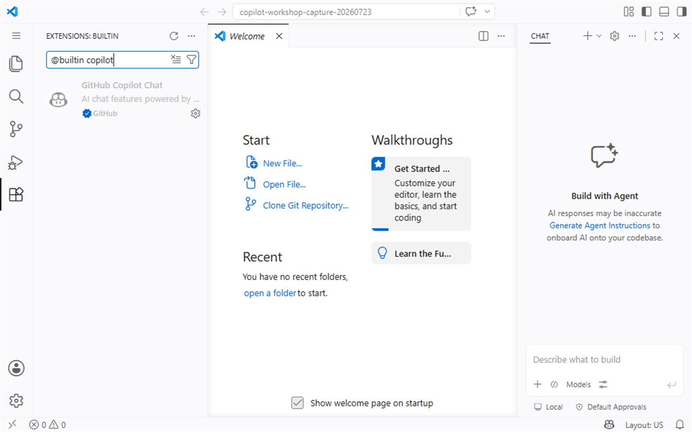
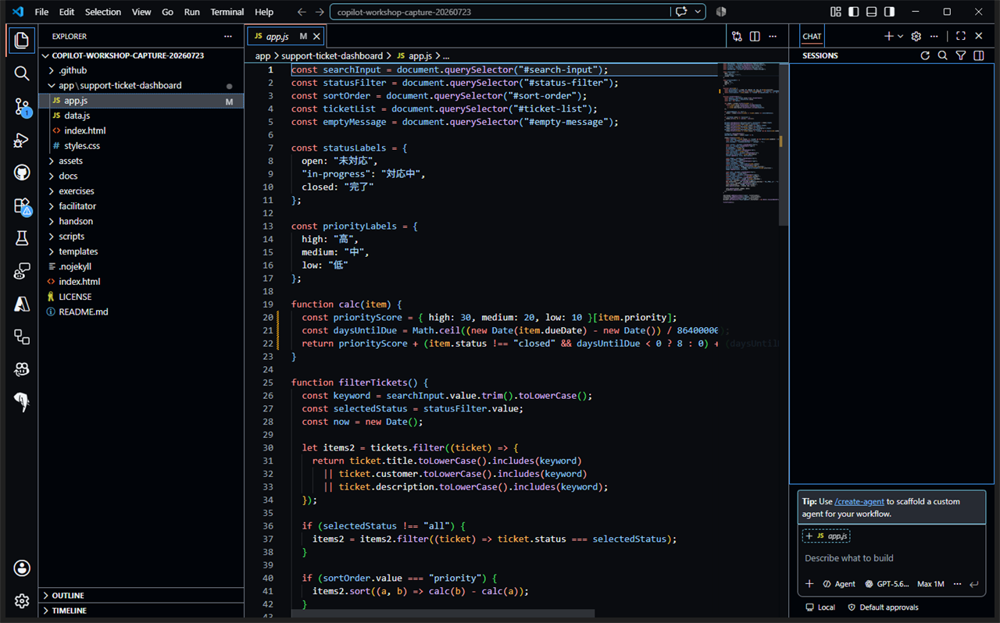
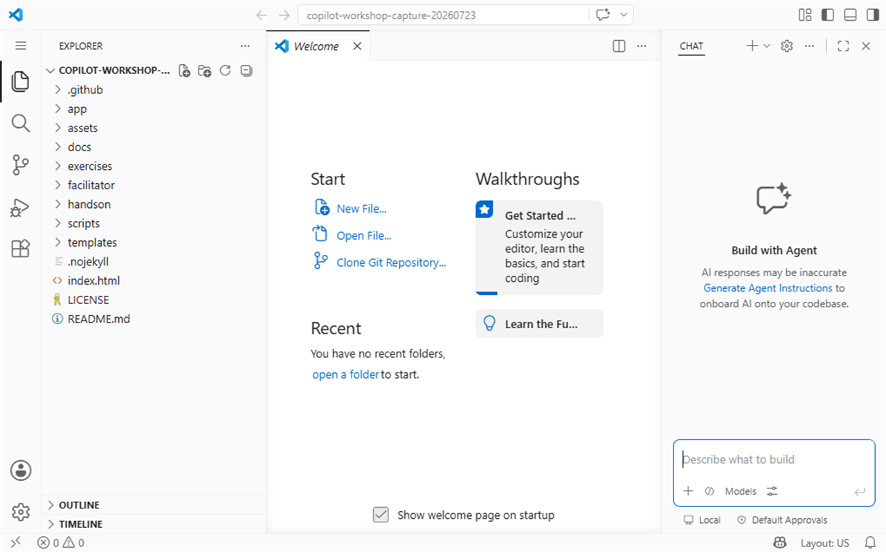
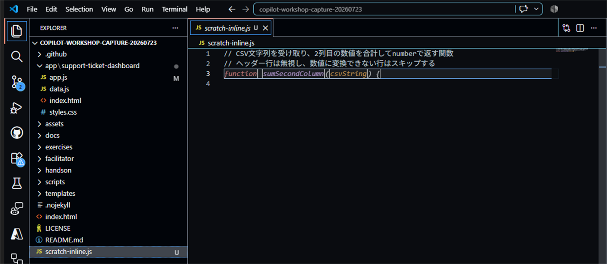

# S0: Introduction and environment setup

**Time: 20 min**
**Theme: Introduction and environment setup**
**Learn alignment: Introduction to GitHub Copilot**

## 目的

このセッションでは、GitHub Copilot の概要を共有し、全員がハンズオンを進められる状態にします。コードを深く変更する前に、エディター、サインイン、Copilot の状態、サンプルリポジトリを確認します。

## このセッションで使う機能

| 機能 / コマンド | 使う目的 |
| --- | --- |
| Extensions | GitHub Copilot / GitHub Copilot Chat 拡張機能を確認する |
| Sign in | GitHub アカウントで Copilot を利用できる状態にする |
| Copilot status | Copilot が有効か、提案を出せる状態か確認する |
| Inline suggestion | コメントから候補が表示されることを確認する |

## 1. GitHub Copilot / Copilot Chat 拡張機能を確認する

1. Visual Studio Code を開きます。
2. 左側の **Extensions** を開きます。
3. `GitHub Copilot` を検索します。
4. `GitHub Copilot` と `GitHub Copilot Chat` が個別に表示される場合、または `GitHub Copilot Chat` が組み込み拡張機能として表示される場合のどちらでも、有効になっていることを確認します。

> **画面例:** Extensions で、組み込みの `GitHub Copilot Chat` と発行元 `GitHub` を確認する画面


確認できたら、次のチェックを付けます。

- [ ] GitHub Copilot 拡張機能が有効になっている
- [ ] GitHub Copilot Chat 拡張機能が有効になっている
- [ ] エディター右下、またはステータスバーで Copilot の状態を確認できる

> [!NOTE]
> 組織や研修環境によって、拡張機能が事前にインストールされている場合があります。無効になっている場合は、講師の案内に従って有効化してください。

## 2. GitHub アカウントでサインインする

[VS CodeでGitHub Copilotへサインインする手順](../docs/vscode-sign-in.md)を開き、次を実施します。

1. 画面右下のCopilotマークから**Continue with GitHub**を選択します。
2. ブラウザーで受講用GitHubアカウントへサインインします。
3. **Authorize Visual Studio Code**でアカウントを確認し、**Continue**を選択します。
4. VS Codeへ戻り、Copilot Chatへ質問を送って応答を確認します。

> **画面例:** Copilot Chat でモデルを選択でき、空の入力欄へ入力できる状態。サインイン要求や利用権限エラーが表示されていないことを確認します。


確認できたら、次のチェックを付けます。

- [ ] GitHub アカウントでサインインできた
- [ ] Copilot Chat の入力欄が表示される
- [ ] Copilot Chatへ質問を送り、応答を受け取れた
- [ ] Copilot の利用権限に関するエラーが出ていない

## 3. 演習用リポジトリを作成してcloneする

1. [画面付きの演習用リポジトリ作成手順](../docs/create-workshop-repository.md)を開きます。
2. [`Tachaan/workshop-github-copilot-basic-attendee`](https://github.com/Tachaan/workshop-github-copilot-basic-attendee)から、受講に使う自分の個人Owner配下へリポジトリを作成します。
3. 作成した自分の演習用リポジトリをローカルへcloneします。
4. cloneしたフォルダー全体をエディターで開きます。

具体的なclone URLとフォルダー名は、自分が作成したリポジトリのものへ置き換えます。

```bash
git clone <自分の演習用リポジトリのURL>
cd <cloneしたフォルダー名>
code .
```

リポジトリを開いたら、次を確認します。

> **画面例:** Explorer で `app`、`docs`、`handson` など、後続セッションで使うフォルダーを確認する画面


- [ ] `handson` フォルダーが見える
- [ ] `app`、`docs` など、後続セッションで使うフォルダーが見える
- [ ] Git のブランチ名を確認できる

> [!IMPORTANT]
> 研修では、講師から指定されたブランチや作業ルールがある場合があります。勝手に main / master へ直接コミットせず、指定された手順に従ってください。

## 4. 作業ブランチ、プレビュー、テストを確認する

ターミナルで現在の状態とブランチを確認します。

```bash
git status --short
git branch --show-current
```

講師から指定されたブランチがない場合は、演習専用ブランチを作成します。

```bash
git switch -c workshop/copilot-practice
```

すでに同名のブランチを作成済みの場合は、`git switch workshop/copilot-practice`で切り替えます。

ターミナルで次を実行します。

```bash
npm run app
```

教材は<http://127.0.0.1:8000/>、Dashboardは<http://127.0.0.1:8000/app/support-ticket-dashboard/>を開きます。

- [ ] Topに`COP / 01`とS0-S7が表示される
- [ ] Dashboardに12件のチケットが表示される

別のターミナルを開き、変更前のテストを確認します。

```bash
npm test
```

## 5. コメントを書いてインライン提案を確認する

`app/support-ticket-dashboard/copilot-practice.js`を開き、次の短いコメントを書きます。このファイルはDashboardから読み込まれないため、安全にインライン提案を試せます。

```javascript
// 2つの数値を受け取り、合計を返す関数
```

数秒待ち、Copilot の薄いグレーの提案が表示されるか確認します。

> **画面例:** 具体化したコメントの直下に、Copilot の関数候補が薄いグレーで表示された状態。採用する前に関数名、引数、戻り値を読みます。


確認すること:

- [ ] コメントの下に候補が表示される
- [ ] `Tab` で候補を採用できる
- [ ] 採用したコードを読み、意図と合っているか確認できる
- [ ] 不要な候補は `Esc` で破棄できる

ここでは候補の品質よりも、Copilot が動作していることを確認するのが目的です。

採用した場合は、`git diff -- app/support-ticket-dashboard/copilot-practice.js`で、この練習ファイルだけが変更されていることを確認します。

## 基本トラブルシューティング

| 症状 | 確認すること |
| --- | --- |
| サインインできない | ブラウザーで GitHub にログインできるか、会社アカウントと個人アカウントを取り違えていないか確認する |
| Copilot Chat が使えない | GitHub Copilot の利用権限、拡張機能の有効状態、エディターの再読み込みを確認する |
| インライン提案が出ない | language support（対象言語が Copilot 対応か）、ファイルが保存されているか、コメントが具体的か確認する |
| ネットワーク / プロキシ（network/proxy）エラーが出る | プロキシ、VPN、社内ネットワークの制限、GitHub への接続可否を確認する |
| 候補が意図と違う | コメントに入力、出力、制約を足して、より具体的にする |

## 完了条件

次をすべて満たしたら、S0 は完了です。

- [ ] GitHub Copilot / Copilot Chat 拡張機能が有効になっている
- [ ] GitHub アカウントでサインインできている
- [ ] サンプルリポジトリをエディターで開いている
- [ ] `workshop/copilot-practice`ブランチで作業している
- [ ] TopとDashboardをWebサーバー経由で開き、12件表示を確認した
- [ ] `npm test`が成功した
- [ ] 簡単なコメントからインライン提案が表示されることを確認した
- [ ] 指定された練習ファイルだけが変更されたことを確認した
- [ ] Copilot の出力は人が確認してから採用することを説明できる

次は [S1: First steps](./01-first-steps.md) に進みます。
