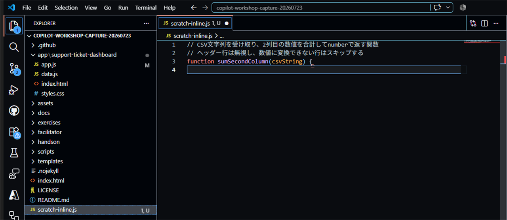
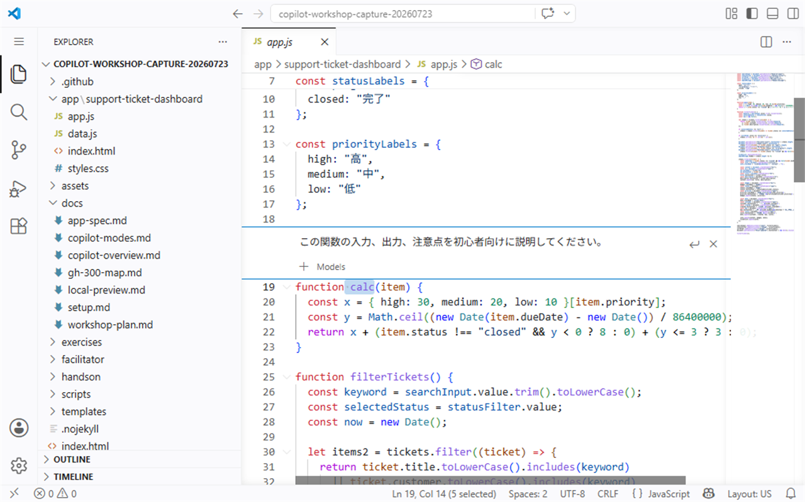
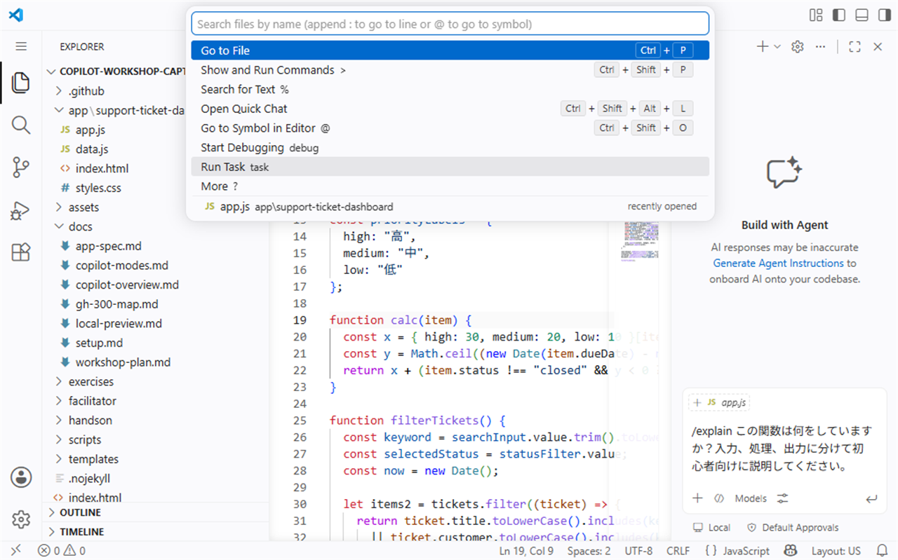
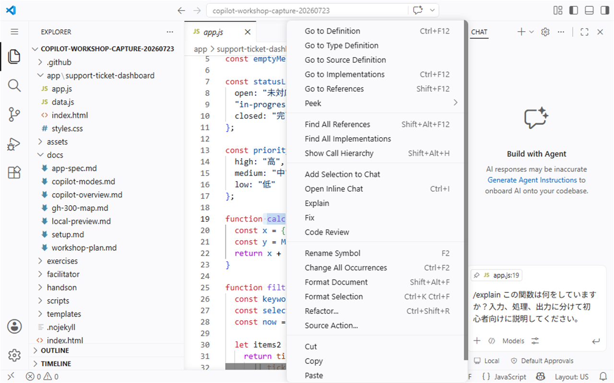

# S1: First steps: inline suggestions and Chat entry points

**Time: 40 min**
**Theme: First steps: inline suggestions and Chat entry points**

## 目的

このセッションでは、GitHub Copilot のインライン補完と、3つの Chat 入口を体験します。提案をすばやく試しながらも、採用前に内容を読む習慣を身につけます。

## このセッションで使う機能

| 機能 | 使う場面 |
| --- | --- |
| `Tab` | インライン提案を採用する |
| Partial accept | 提案の一部だけを採用する |
| `Esc` | 不要な提案を破棄する |
| Inline Chat | 選択したコードの近くで質問・修正依頼をする |
| Quick Chat | 画面を大きく切り替えずに短い質問をする |
| Chat View | 会話を残しながら、まとまった相談をする |
| Smart Actions | 利用できる環境で、説明、修正、テスト生成などの定型操作を使う |

## 1. コメントから関数を生成する

練習用ファイルを開き、次のコメントを書きます。

```javascript
// CSV を読み込んで合計を返す関数
```

Copilot の候補が表示されたら、すぐに採用せず、次を確認します。

- 入力は文字列か、ファイルパスか
- CSV のどの列を合計しているか
- 数値に変換できない値をどう扱っているか
- 戻り値の型は何か
- エラー時の動きが分かるか

候補が曖昧な場合は、コメントを具体化します。

```javascript
// CSV文字列を受け取り、2列目の数値を合計してnumberで返す関数
// ヘッダー行は無視し、数値に変換できない行はスキップする
```

確認できたら、次のチェックを付けます。

- [ ] コメントから関数候補が表示された
- [ ] 最初の候補と、具体化したコメント後の候補の違いを説明できる
- [ ] 採用前に入力、出力、例外的な値を確認した

## 2. Tab 採用、部分採用、Esc 破棄を試す

同じ練習用ファイルで、複数の候補操作を試します。

| 操作 | やること | 確認すること |
| --- | --- | --- |
| `Tab` accept | 提案全体を採用する | 意図に合う候補だけを採用したか |
| Partial accept | 単語単位、行単位など一部だけ採用する | 便利な部分だけ残し、不要な部分を入れないようにできたか |
| `Esc` discard | 提案を破棄する | 合わない候補を無理に使っていないか |

> **画面例:** 具体化した CSV コメントから提案された関数宣言を `Tab` で採用し、コードが通常色に変わった状態


部分採用のショートカットやコマンド名は、VS Code と Copilot のバージョンによって異なります。コマンドパレットに `Accept Next Word` や `Accept Next Line` が表示されない場合は、キーボードショートカット設定で `inline suggestion` を検索するか、講師の案内に従ってください。

> [!IMPORTANT]
> Copilot の提案は「候補」であり「正解」ではありません。短い候補でも、仕様、型、境界値、セキュリティへの影響を確認してから採用します。

## 3. 選択したコードで Inline Chat を使う

生成された関数、または既存の短い関数を選択し、Inline Chat を開きます。次のように依頼します。

```text
この関数の入力、出力、注意点を初心者向けに説明してください。
```

> **画面例:** `calc` を選択し、コードの近くで Inline Chat を開いて説明を入力した状態


続けて、同じ選択範囲に対して依頼します。

```text
読みやすさを改善する案を出してください。まだ変更は適用しないでください。
```

確認すること:

- [ ] 選択範囲に限定した説明が返ってくる
- [ ] 変更案が出ても、すぐ適用せず内容を読める
- [ ] 変更が必要な理由と、動作が変わらないことを確認できる

Inline Chat は、今見ているコードに近い場所で質問できるのが利点です。広い調査よりも、選択したコードの説明や小さな改善相談に向いています。

## 4. Chat View と Quick Chat を比べる

同じ質問を、Chat View と Quick Chat の両方で試します。

> **画面例:** 右側の Chat View を開いたまま、上部の Quick Access で `Open Quick Chat` の入口を確認する画面


```text
このリポジトリで最初に読むべきファイルを、理由つきで3つ挙げてください。
```

比べる観点:

| 観点 | Chat View | Quick Chat |
| --- | --- | --- |
| 向いている質問 | 複数ターンの相談、調査、計画 | 短い確認、今すぐ聞きたい質問 |
| 会話の見やすさ | 履歴を追いやすい | 作業中の画面を保ちやすい |
| 使いどころ | 仕様確認、調査、レビュー観点の整理 | コマンド確認、短い説明、言い換え |

確認できたら、次のチェックを付けます。

- [ ] Chat View を開いて質問できた
- [ ] Quick Chat を開いて質問できた
- [ ] どちらを使うと作業しやすいか、自分の言葉で説明できる

## 5. Smart Actions を使う

利用できる環境では、ファイル、選択範囲、エラー、テストなどに対して Smart Actions が表示されます。表示された場合は、次のような操作を試します。

> **画面例:** 選択範囲のコンテキストメニューに `Add Selection to Chat`、`Open Inline Chat`、`Explain`、`Fix`、`Code Review` が表示された状態


- 選択したコードを説明する
- 選択したコードの改善案を出す
- テスト観点を提案する
- エラーや警告の原因を説明する

Smart Actions が表示されない環境では、同じ内容を Chat に手入力してかまいません。

```text
選択したコードについて、何をしているか、改善できる点、確認すべきテスト観点を表にしてください。
```

## 完了条件

次をすべて満たしたら、S1 は完了です。

- [ ] コメントからインライン提案を出し、内容を読んでから採用できた
- [ ] `Tab` 採用、部分採用、`Esc` 破棄を試した
- [ ] Inline Chat を選択範囲に対して使えた
- [ ] Chat View と Quick Chat の使い分けを説明できる
- [ ] Smart Actions、または同等の Chat 依頼を試した
- [ ] Copilot の提案は候補であり、最終判断は人が行うことを説明できる

次は [S2: Prompt engineering basics](./02-prompt-basics.md) に進みます。
