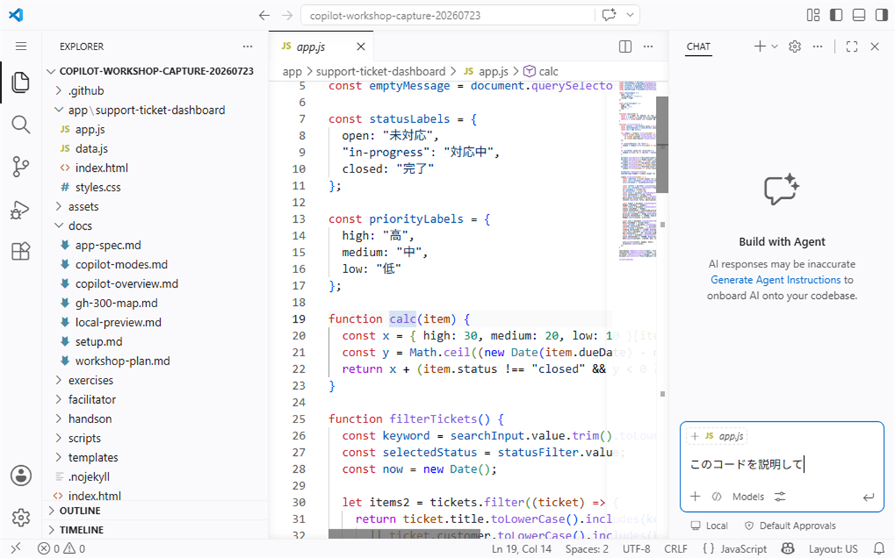
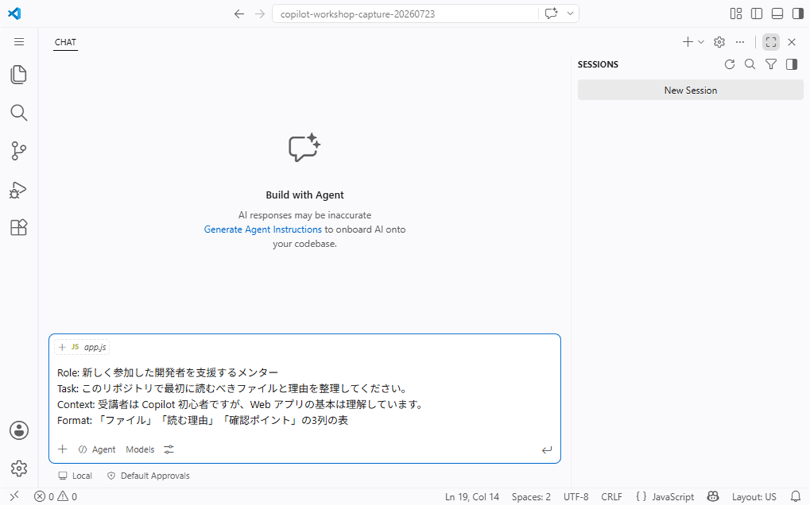
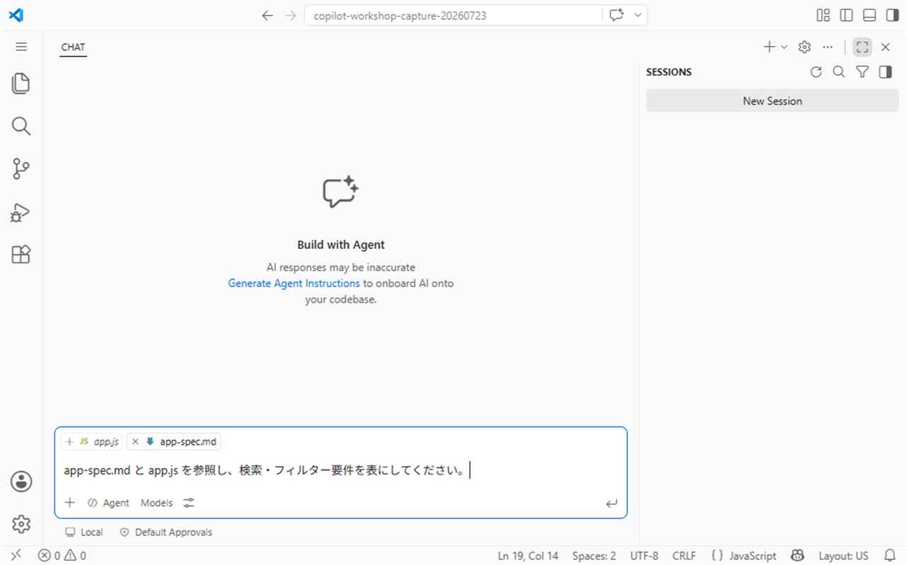

# S2: Prompt engineering basics

**Time: 30 min**
**Theme: Prompt engineering basics**

## 目的

このセッションでは、Copilot に依頼するときのプロンプトの型と、文脈の渡し方を練習します。曖昧な依頼と、Role + Task + Context + Format を含む依頼を比べ、出力の違いを確認します。

## このセッションで使う文脈指定

| 指定方法 | 使う目的 |
| --- | --- |
| `@workspace` | リポジトリ全体を踏まえた質問をする |
| `#file` | 特定ファイルを明示して質問する |
| 選択範囲 | 今見ているコードの一部に絞って質問する |
| スラッシュコマンド | 説明、修正、テストなど定型の依頼をすばやく始める |
| Chat variables | 現在のファイル、選択範囲、ターミナルなどの文脈を渡す |
| Chat participants | `@workspace` など、目的に合う参加者へ依頼する |

## 1. 曖昧なプロンプトと具体的なプロンプトを比べる

まず、Chat View で曖昧な依頼を試します。

```text
このコードを説明して
```

> **画面例:** 対象や出力形式を指定せず、短い依頼だけを Chat View に入力した状態


回答を読み、次を確認します。

- どのファイルや範囲を説明しているか分かるか
- 説明の深さは十分か
- 受講者が次に何をすればよいか分かるか

次に、Role + Task + Context + Format を入れて依頼します。

```text
あなたは新しく参加した開発者を支援するメンターです。
Task: このリポジトリの構成を理解するため、最初に読むべきファイルと理由を整理してください。
Context: 受講者は GitHub Copilot を使い始めたばかりですが、Webアプリの基本は理解しています。
Format: 「ファイル」「読む理由」「確認するポイント」の3列の表で回答してください。
```

> **画面例:** Role、Task、Context、Format を分けて構造化したプロンプトを入力した状態


比べる観点:

- [ ] 回答の対象が明確になったか
- [ ] 表など、指定した形式で返ってきたか
- [ ] 次に開くファイルや確認観点が具体的になったか

## 2. 文脈を適切に渡す

プロンプトは長ければよいわけではありません。必要な範囲を明示し、広すぎる文脈を避けることが重要です。

### `@workspace` を使う

リポジトリ全体を踏まえて質問したいときに使います。

```text
@workspace このリポジトリで Support Ticket Dashboard の画面表示に関係するファイルを探し、役割を表にしてください。
internalMemo の具体値は引用・要約・出力せず、項目名と扱いだけを確認してください。
```

### `#file` を使う

特定ファイルを前提にしたいときに使います。エディターの候補から対象ファイルを選びます。

```text
#file:handson/README.md このページの受講者向けチェック項目を、初心者にも分かる表現で要約してください。
```

> **画面例:** `app.js` と `app-spec.md` を Chat の文脈に追加し、参照対象を明示した状態


### 選択範囲を使う

コードの一部だけを説明してほしい場合は、対象範囲を選択してから依頼します。

```text
選択した範囲について、入力、出力、副作用、注意点を表にしてください。
```

### スラッシュコマンド、Chat variables、Chat participants を使う

環境で利用できる場合は、次のような入口も試します。

| 入口 | 例 | 使いどころ |
| --- | --- | --- |
| スラッシュコマンド | `/explain`、`/fix`、`/tests` | 定型の依頼を短く始める |
| Chat variables | 現在のファイル、選択範囲、ターミナル出力など | 手で貼り付けずに文脈を渡す |
| Chat participants | `@workspace` など | リポジトリ調査など、目的に合う参加者へ依頼する |

確認すること:

- [ ] 広い質問では `@workspace` を使えた
- [ ] ファイルを絞る質問では `#file` を使えた
- [ ] 選択範囲に限定した質問ができた
- [ ] スラッシュコマンド、Chat variables、Chat participants の入口を確認した

## 3. Zero-shot と few-shot を理解する

| 用語 | 初心者向けの説明 | 例 |
| --- | --- | --- |
| Zero-shot | 例を渡さず、依頼だけで回答してもらう | 「この関数を説明してください」 |
| Few-shot | 期待する例を少し渡してから、同じ形式で回答してもらう | 「この例と同じ形式で、次の関数も説明してください」 |

Zero-shot は短く始められますが、期待する粒度や形式がずれることがあります。Few-shot は例を用意する手間がありますが、表現や形式をそろえやすくなります。

Few-shot の例:

```text
次の形式でコードを説明してください。

例:
関数: calculateTotal
目的: 注文金額の合計を計算する
入力: 商品価格の配列
注意点: 数値以外が含まれる場合の扱いを確認する

同じ形式で、選択した関数を説明してください。
```

## 4. フォローアップで改善する

最初の回答で終わらせず、足りない点を具体的に追加で依頼します。

```text
説明は分かりました。次に、初心者が誤解しやすい点を3つ追加してください。
```

```text
表の内容を、実際に確認するファイルパスとチェック項目に分けてください。
```

```text
今の回答に推測が含まれる場合は、推測とファイルから確認できる事実を分けてください。
```

フォローアップでは、回答全体をやり直させるよりも、足りない条件を明確に追加する方が安定します。

## 使い回せるプロンプトテンプレート

### 既存コードを理解する

```text
あなたはこのリポジトリに新しく参加した開発者を支援するメンターです。
Task: 対象機能の処理の流れを説明してください。
Context: 対象は <機能名> です。必要に応じて @workspace を使って関連ファイルを探してください。
Format: 「ファイル」「役割」「読む順番」「確認ポイント」の表で回答してください。
制約: まだコードは変更しないでください。
```

### 仕様との差分を探す

```text
あなたは仕様レビューを支援する開発者です。
Task: 仕様書と実装のズレ、または仕様書に不足している説明を探してください。
Context: 仕様書は <仕様ファイル>、実装は <対象フォルダー> です。
Format: 「仕様書の記述」「実装で確認した事実」「ズレまたは不足」「次に確認すること」の表で回答してください。
制約: 推測とファイルから確認できる事実を分けてください。まだ編集はしないでください。
```

### リファクタリング計画を作る

```text
あなたは安全なリファクタリングを支援するペアプログラマーです。
Task: 動作を変えずに読みやすくするための計画を立ててください。
Context: 対象は <ファイルまたは関数> です。既存のテストまたは確認手順も考慮してください。
Format: 「変更候補」「理由」「影響範囲」「確認方法」の表で回答してください。
制約: まだコードは変更しないでください。外部仕様が変わる提案は分けてください。
```

### 出力をレビューする

```text
あなたはコードレビュー担当者です。
Task: 次の提案に問題がないか確認してください。
Context: 目的は <目的> です。変更してよい範囲は <範囲> だけです。
Format: 「確認結果」「根拠」「修正が必要な場合の提案」の表で回答してください。
制約: セキュリティ、プライバシー、既存動作への影響を優先して確認してください。
```

## 完了条件

次をすべて満たしたら、S2 は完了です。

- [ ] 曖昧なプロンプトと、Role + Task + Context + Format を含むプロンプトの違いを説明できる
- [ ] `@workspace`、`#file`、選択範囲を使い分けられる
- [ ] スラッシュコマンド、Chat variables、Chat participants の入口を確認した
- [ ] Zero-shot と few-shot の違いを初心者向けに説明できる
- [ ] フォローアップで回答を具体化できる
- [ ] 文脈は広げすぎず、目的に合う範囲へ絞ると出力が改善することを説明できる

次は [S3: Understand existing code](./03-code-understanding.md) に進みます。
