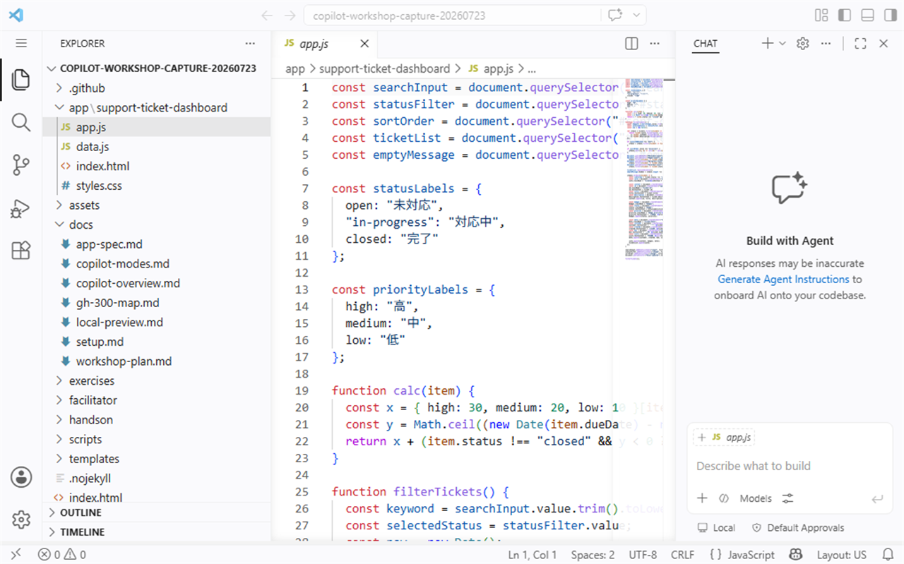
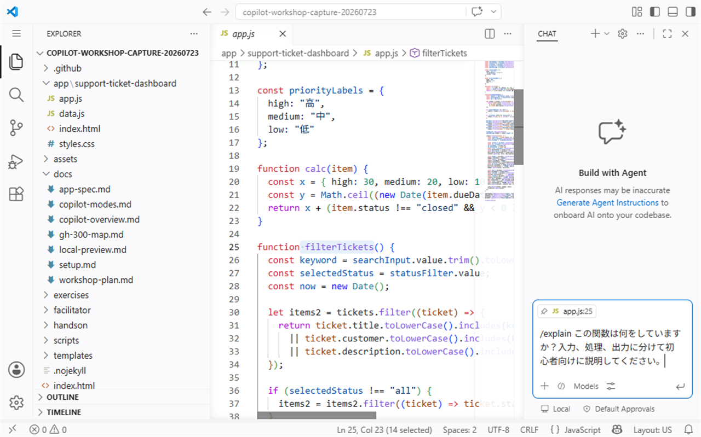

# S3: 既存コードを理解する

## 目的

このセッションでは、GitHub Copilot を使って、初めて見る小さなコードベースを短時間で理解します。コードを変更する前に、ファイルの役割、処理の入口、データの流れ、検索・フィルタ処理の場所を確認できるようになることが目標です。

対象時間は **40分** です。

## Learn alignment

このハンズオンは Microsoft Learn の **Generate documentation using GitHub Copilot tools** の観点に沿い、Copilot の説明を使って既存コードの理解とドキュメント化の準備を行います。

## 使う機能

| 機能 | 使いどころ |
| --- | --- |
| `/explain` | 関数や選択したコードの処理を説明してもらう |
| `@workspace` | リポジトリ全体を対象に、関連ファイルや利用箇所を探す |
| Chat View | 質問を重ねながら、コード理解のメモを整理する |

## シナリオ

あなたは Support Ticket Dashboard を引き継いだ開発者です。実装を直す前に、アプリの入口、チケットデータ、検索・フィルタ処理、画面更新の流れを把握します。

このセッションでは、Copilot の説明をそのまま信じるのではなく、必ず実際のファイルを開いて確認します。

## 準備

1. エディターでリポジトリ全体を開きます。
2. GitHub Copilot Chat の **Chat View** を開きます。
3. 次のファイルがあることを確認します。

| パス | 確認する内容 |
| --- | --- |
| `app/support-ticket-dashboard/index.html` | 画面の入口と読み込むスクリプト |
| `app/support-ticket-dashboard/app.js` | 検索、絞り込み、並び替え、描画処理 |
| `app/support-ticket-dashboard/data.js` | チケットのサンプルデータ |
| `docs/app-spec.md` | アプリの仕様 |

> **画面例:** Explorer で Support Ticket Dashboard の主要ファイルと `docs/app-spec.md` を展開し、`app.js` を開いた状態


## Exercise 1: `/explain` で1つの関数を理解する

まず、1つの関数に範囲を絞って説明を確認します。

1. `app/support-ticket-dashboard/app.js` を開きます。
2. `filterTickets` 関数全体を選択します。
3. Copilot Chat に次のプロンプトを入力します。

```text
/explain この関数は何をしていますか？入力、処理、出力に分けて初心者向けに説明してください。
```

> **画面例:** `filterTickets` を選択し、`/explain` の依頼を送信する前の状態


回答を見ながら、次をファイル上で確認します。

- [ ] 検索キーワードを取得している箇所
- [ ] ステータスを取得している箇所
- [ ] チケット配列を絞り込んでいる箇所
- [ ] 画面の件数や一覧を更新している箇所

説明が長すぎる場合は、次のように聞き直します。

```text
filterTickets 関数を「入力」「絞り込み」「並び替え」「集計」「描画」の5つに分けて、各ブロックの役割を短く説明してください。
```

## Exercise 2: 1ファイル全体を説明してもらう

次に、ファイル全体の責務を把握します。

Copilot Chat に次のプロンプトを入力します。

```text
app/support-ticket-dashboard/app.js 全体の役割を説明してください。主要な変数、関数、イベントリスナーを表にしてください。コードは変更しないでください。
```

回答を確認するときは、次の点に注意します。

- [ ] `calc` と `filterTickets` の役割が区別されている
- [ ] `searchInput`、`statusFilter`、`sortOrder` がどの画面要素に対応するか説明されている
- [ ] `addEventListener` により、入力や選択変更で一覧が更新されることを確認できる
- [ ] Copilot が存在しないファイル名や関数名を挙げていない

分からない言葉が出た場合は、続けて質問します。

```text
今の説明に出てきた DOM、イベントリスナー、配列の filter/sort を、このアプリのコードに沿って説明してください。
```

## Exercise 3: `@workspace` でリポジトリ横断の質問をする

ファイル単体では分からないことを、`@workspace` を使って確認します。回答に出てきたファイルは、必ず自分でも開いて確認します。

次の質問を1つずつ試してください。

```text
@workspace status の値 open、in-progress、closed は、どのファイルで定義・利用されていますか？
internalMemo の具体値は引用・要約・出力せず、項目名と扱いだけを確認してください。
```

```text
@workspace エントリポイントはどこですか？画面が表示されてからチケット一覧が描画されるまでの流れを説明してください。
internalMemo の具体値は引用・要約・出力せず、項目名と扱いだけを確認してください。
```

```text
@workspace 検索・フィルタ処理の流れを説明してください。関連するファイル、関数、画面要素を「ファイル」「役割」「根拠」の3列の表にしてください。
internalMemo の具体値は引用・要約・出力せず、項目名と扱いだけを確認してください。まだコードは変更しないでください。
```

> **画面例:** Copilot の回答表と `app.js` を並べ、回答に示された関数、画面要素、根拠の行番号を実ファイルで照合する画面


回答を確認するときは、次の観点で照合します。

- [ ] `index.html` から `data.js` と `app.js` が読み込まれている
- [ ] `data.js` の `tickets` が `app.js` で利用されている
- [ ] 検索対象が画面のプレースホルダーや仕様書と一致しているか確認できる
- [ ] ステータス値と表示ラベルの対応を説明できる

## Exercise 4: モジュール責務を3行で要約する

Copilot の説明を参考にしつつ、最後は自分の言葉でまとめます。次の形式で、各ファイルの責務を3行以内で書いてください。

```text
index.html:
data.js:
app.js:
```

必要に応じて、Copilot に下書きを作ってもらいます。

```text
Support Ticket Dashboard の index.html、data.js、app.js の責務を、初心者にも分かる3行のメモにしてください。ただし、私が後で実際のコードと照合できるように、根拠となるファイル名を含めてください。
```

Copilot の下書きは、そのまま提出せず、自分で読み直して必要な言葉に直します。

## チェックポイント

このセッションの重要な確認点は、**Copilot の説明が実際のコードと一致しているかを検証すること**です。

次の質問に答えられるか確認してください。

| 質問 | 確認するファイル |
| --- | --- |
| 画面の入口はどこか | `index.html` |
| チケットデータはどこで定義されているか | `data.js` |
| 検索・フィルタ処理はどこにあるか | `app.js` |
| 一覧の再描画はどの関数で行われるか | `app.js` |
| 仕様書と実装で確認が必要な差分はあるか | `docs/app-spec.md`, `app/support-ticket-dashboard/*` |

## 完了条件

次をすべて満たしたら、このセッションは完了です。

- [ ] `/explain` を使って、1つの関数の役割を説明できた
- [ ] `app.js` 全体の主要な変数、関数、イベントリスナーを確認した
- [ ] `@workspace` を使って、エントリポイントと検索・フィルタ処理の流れを確認した
- [ ] Copilot の回答を、実際のファイルと照合した
- [ ] `index.html`、`data.js`、`app.js` の責務を自分の言葉で3行にまとめた
- [ ] このセッションではアプリのコードを変更していない

次は [S4: 仕様とドキュメントを整理する](./04-documentation.md) に進みます。
