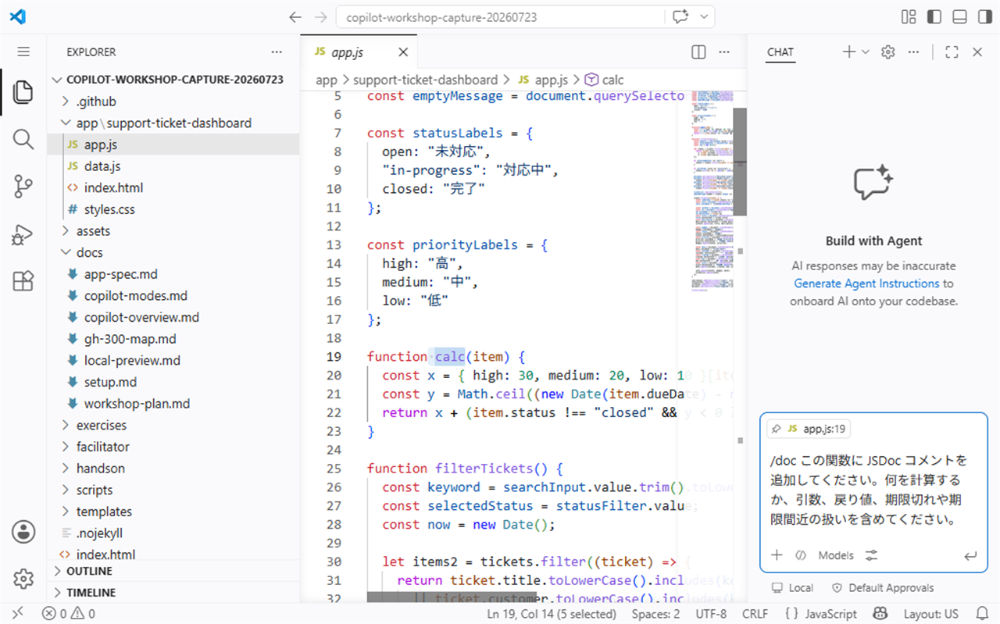
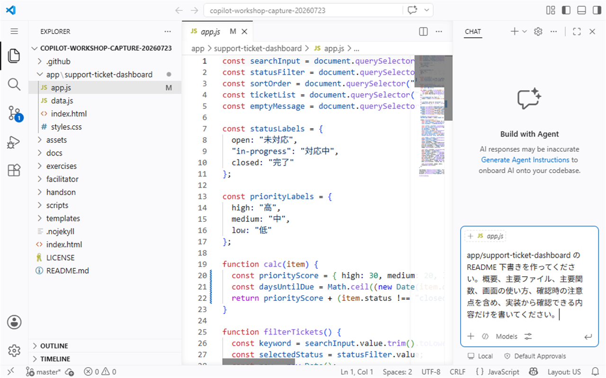
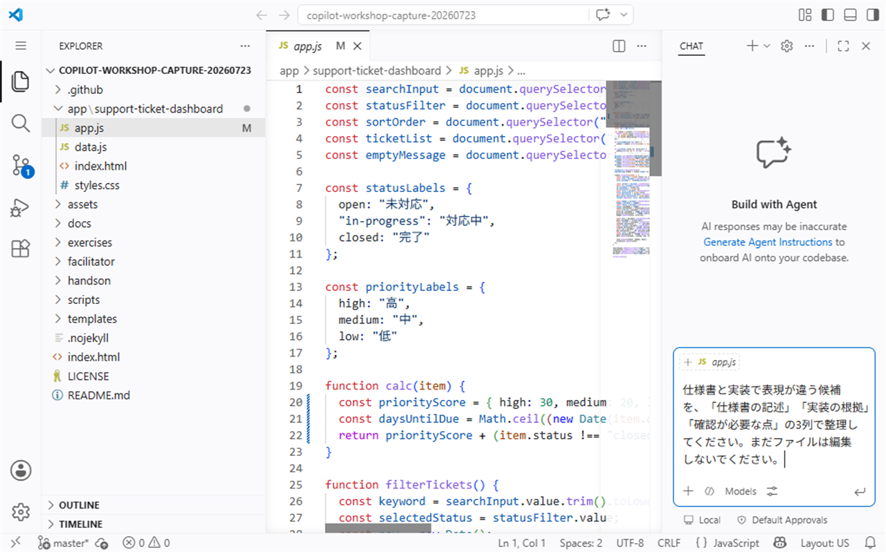

# S4: 仕様とドキュメントを整理する

## 目的

このセッションでは、既存コードをもとに GitHub Copilot でドキュメントの下書きを作り、事実確認と用語の整理を行います。新しいアプリを作るのではなく、すでにある Support Ticket Dashboard のコードから、関数コメント、モジュール README、仕様メモを作成・改善することが目標です。

対象時間は **40分** です。

## Learn alignment

このハンズオンは Microsoft Learn の **Generate documentation using GitHub Copilot tools** の観点に沿い、Copilot を使ってコードから説明文を生成し、人がレビューして公開できる形に整える流れを練習します。

## 使う機能

| 機能 | 使いどころ |
| --- | --- |
| `/doc` | 選択した関数に docstring、JSDoc、XML コメントなどの下書きを作る |
| Chat View | README や仕様メモの下書きを生成し、レビュー観点を整理する |
| Inline Chat | エディター上で短い説明やコメントを追加・修正する |

## シナリオ

前のセッションで、Support Ticket Dashboard のファイル構成と処理の流れを確認しました。次は、後から参加する開発者が迷わないように、コードから読み取れる事実をドキュメントに整理します。

Copilot は下書き作成に使いますが、公開してよい内容かどうかは、必ずコードと仕様書を見て判断します。

## 準備

1. エディターでリポジトリ全体を開きます。
2. `app/support-ticket-dashboard/app.js` と `docs/app-spec.md` を開きます。
3. 作業用ブランチで演習していることを確認します。
4. ドキュメント生成後は、差分を確認してから採用する前提で進めます。

> [!IMPORTANT]
> 生成されたドキュメントは、Copilot の回答ではなく **実際のコード** を根拠に確認します。実装から読み取れない内容や、推測で追加された仕様は採用しません。

## Exercise 1: `/doc` で既存関数にコメントを追加する

まず、既存関数の説明コメントを生成します。

1. `app/support-ticket-dashboard/app.js` を開きます。
2. `calc` 関数を選択します。
3. Copilot Chat または Inline Chat に次のプロンプトを入力します。

```text
/doc この関数に JSDoc コメントを追加してください。何を計算するか、引数、戻り値、期限切れや期限間近の扱いが分かるようにしてください。
```

> **画面例:** `calc` を選択し、事実ベースの JSDoc を依頼する `/doc` プロンプトを入力した状態


生成されたコメントを確認するときは、次を照合します。

- [ ] 優先度ごとの基本点がコードと一致している
- [ ] 期限切れチケットへの加点条件がコードと一致している
- [ ] 期限が近い場合の加点条件がコードと一致している
- [ ] 戻り値が数値であることが説明されている
- [ ] コードにない例外や副作用が書かれていない

必要なら、次のように修正を依頼します。

```text
実装から読み取れる内容だけに絞って、JSDoc を短くしてください。推測の注意書きは入れないでください。
```

## Exercise 2: モジュール README の下書きを生成する

次に、`app/support-ticket-dashboard` の README 下書きを作ります。リポジトリに保存する前に、まず Chat View で内容を確認します。

Copilot Chat に次のプロンプトを入力します。

```text
app/support-ticket-dashboard の README 下書きを作ってください。概要、主要ファイル、主要関数、画面の使い方、確認時の注意点を含めてください。実装から確認できる内容だけを書いてください。
internalMemo の具体値は引用・要約・出力せず、項目名と安全な扱いだけを書いてください。
```

> **画面例:** モジュール README の構成と制約を Chat View に入力し、送信前に対象を確認する画面


下書きには、少なくとも次の項目が含まれているか確認します。

| 項目 | 確認する内容 |
| --- | --- |
| 概要 | Support Ticket Dashboard がチケット一覧を表示すること |
| 主要ファイル | `index.html`、`data.js`、`app.js`、`styles.css` の役割 |
| 主要関数 | `calc` と `filterTickets` の説明 |
| 使い方 | 検索、ステータス選択、並び順選択 |
| 注意点 | 生成内容を仕様書やコードと照合すること |

保存する場合は、講師の指示に従います。このセッションの目的は、README の完成そのものではなく、**コードから事実ベースの下書きを作り、レビューする練習**です。

## Exercise 3: 入力・出力・前提条件・例外を仕様メモに整理する

`filterTickets` 関数を題材に、コードから仕様メモを抽出します。

Copilot Chat に次のプロンプトを入力します。

```text
app/support-ticket-dashboard/app.js の filterTickets 関数から、入力、出力、前提条件、例外または注意点を仕様メモとして整理してください。表形式にし、実装から分かることだけを書いてください。
internalMemo の具体値は引用・要約・出力しないでください。
```

出力された表を、次の観点で確認します。

- [ ] 入力に検索欄、ステータス選択、並び順選択が含まれている
- [ ] 出力に表示件数、ステータス別件数、期限切れ件数、チケット一覧の更新が含まれている
- [ ] 前提条件に `tickets` 配列と必要な DOM 要素が含まれている
- [ ] 例外やエラー処理について、コードにない内容が追加されていない
- [ ] 仕様書 `docs/app-spec.md` と表現が大きくずれていない

仕様書と異なる表現を見つけた場合は、どちらが正しいかをすぐに決めず、次のように整理します。

```text
仕様書と実装で表現が違う候補を、仕様書の記述、実装の根拠、確認が必要な点の3列で整理してください。
```

> **画面例:** 仕様書と実装の差分候補を3列で整理し、まだ編集しないよう制約を付けた送信前の画面


## Exercise 4: 生成ドキュメントをレビューする

最後に、生成したコメント、README 下書き、仕様メモをレビューします。

次のプロンプトを使って、レビュー観点を作ってもらいます。

```text
今作成したドキュメント下書きをレビューする観点を作ってください。事実の正確性、用語の一貫性、初心者への分かりやすさ、公開前に確認すべき差分に分けてください。
```

レビューでは、特に次を確認します。

- [ ] コードにない機能を追加で説明していない
- [ ] `open`、`in-progress`、`closed` と、画面上の日本語ラベルの対応が正しい
- [ ] 「検索」「絞り込み」「並び順」「優先度スコア」の用語が一貫している
- [ ] 仕様書と違う内容は、差分候補として扱っている
- [ ] 公開前に講師またはペアレビューで確認できる形になっている

## チェックポイント

このセッションの重要な確認点は、**生成されたドキュメントをレビューしてから公開すること**です。

次の表を使って、採用可否を判断します。

| 確認項目 | 採用してよい状態 |
| --- | --- |
| 事実の正確性 | 実装ファイルで根拠を確認できる |
| 用語の一貫性 | 仕様書、画面、コードの呼び方が整理されている |
| 範囲の適切さ | 今回のコードから分かる内容に限定されている |
| 読みやすさ | 後から参加する開発者が短時間で理解できる |
| 差分確認 | 追加・変更したドキュメントを自分で確認している |

## 完了条件

次をすべて満たしたら、このセッションは完了です。

- [ ] `/doc` を使って、既存関数のコメント下書きを作成した
- [ ] モジュール README の下書きに、概要、主要ファイル、主要関数、使い方を含めた
- [ ] コードから入力、出力、前提条件、例外または注意点を仕様メモに整理した
- [ ] 生成ドキュメントを、実際のコードと仕様書に照らしてレビューした
- [ ] 事実確認が終わるまで、生成内容を公開済みドキュメントとして扱っていない
- [ ] Copilot の提案を採用する前に、差分と用語の一貫性を確認した

次は [S5: 既存コードをテストで守りながらリファクタリングする](./05-refactoring.md) に進みます。
