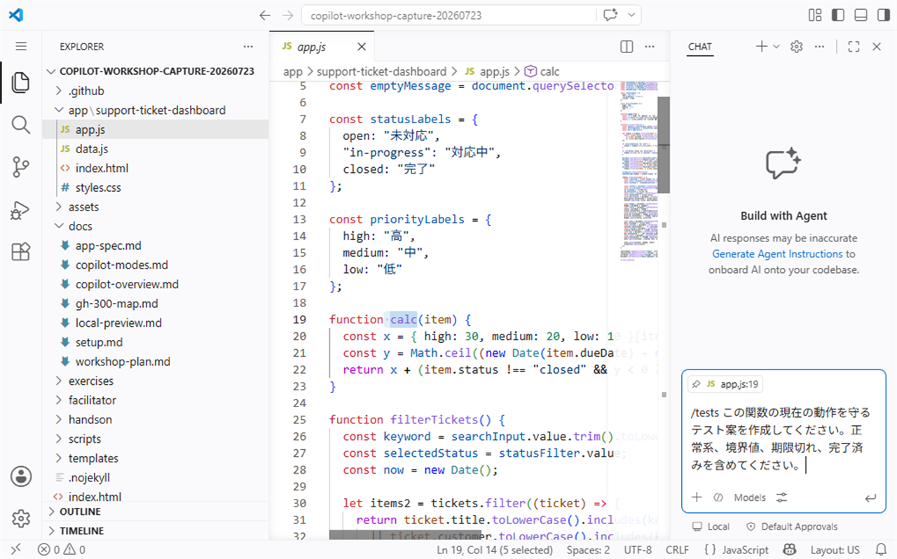

# S5: 既存コードをテストで守りながらリファクタリングする

このハンズオンでは、GitHub Copilot を使って既存コードを安全に改善します。最初にテストや確認観点を用意し、次に小さくリファクタリングし、最後に差分とテスト結果を人間が確認します。

| 項目 | 内容 |
| --- | --- |
| 時間 | 45分 |
| 目的 | テストで動作を守りながら、読みやすさ、重複、命名を改善する |
| Learn alignment | Develop code features using GitHub Copilot tools / refactor and optimization |
| 主に使う機能 | `/tests`, `/fix`, Smart Actions, Inline Chat |

## このハンズオンのゴール

- 既存コードを変更する前に、期待動作をテストまたは確認観点として固定する
- 長い処理、重複、曖昧な命名を見つけ、動作を変えずに整理する
- Copilot の提案をそのまま採用せず、差分とテスト結果を確認して判断する
- `tests -> refactor -> diff review -> rerun tests` の順番を説明できる

リファクタリングは、外から見える動作を変えずに内部構造を改善する作業です。機能追加や画面デザイン変更を同時に行うと、問題が起きたときに原因を追いにくくなります。

## 1. 対象にするレガシー関数を選ぶ

まず、`app/support-ticket-dashboard` の中から、改善したい関数を1つ選びます。例として、検索、フィルタ、ソート、表示補助など複数の責務を持つ関数を探します。

Copilot Chat を **Ask Mode** にして、次のように質問します。

```text
app/support-ticket-dashboard のコードを読み、リファクタリング候補になる関数を3つ挙げてください。
特に、読みやすさ、重複、命名、責務の多さに注目してください。
まだコードは編集しないでください。
```

回答を見たら、必ず自分でもファイルを開いて確認します。

- 関数が何を入力として受け取るか
- 何を返すか、またはどの状態を更新するか
- 検索、絞り込み、並べ替え、描画など複数の責務が混ざっていないか
- 名前から役割を推測できるか
- 変更すると影響を受ける呼び出し元がどこか

今回は、対象を1つに絞ります。複数の関数を一度に変更すると、テスト失敗や表示崩れの原因を切り分けにくくなります。

## 2. 変更前の期待動作を固定する

コードを変える前に、現在の動作を確認します。このリポジトリには、Node.js標準テストランナーを使うベースラインテストがあります。まず、Copilotにテストの場所と実行方法を根拠付きで確認させます。

```text
このリポジトリで実行できる既存のテストコマンドを確認してください。
README、package.json、テストファイルを根拠にし、見つからない場合は「未確認」と答えてください。
まだファイルは編集しないでください。
```

`package.json`と`tests/dashboard.test.js`を自分でも開き、リファクタリング前に実行します。

```bash
npm test
```

すべて成功することを確認し、ブラウザーでの手動確認も残します。

| 観点 | 変更前に確認すること |
| --- | --- |
| 検索 | 代表的な検索語、空文字、該当なしで結果を確認する |
| フィルタ | 各ステータスを選んだときの件数と内容を確認する |
| ソート | 優先度や期限など、並び順が変わる操作を確認する |
| 組み合わせ | 検索とフィルタを同時に使った結果を確認する |
| エラー | ブラウザーの Console にエラーが出ていないか確認する |

> **画面例:** 検索語 `API`、ステータス `対応中`、並び順 `優先度の高い順` を組み合わせ、結果が1件になることを手動確認する画面


この時点の結果が、リファクタリング後に守るべき基準です。

## 3. `/tests` でテスト案を作る

次に、Copilot Chat で `/tests` を使い、選んだ関数の期待動作をテストとして表現します。`tests/dashboard.test.js`のNode.js標準テストランナーの書き方に合わせます。

```text
/tests
選んだ関数について、現在の動作を守るためのテストを作成してください。
tests/dashboard.test.jsの書き方に合わせ、今回選んだ関数の正常系と境界条件を含めてください。
テストを通すために本体の挙動は変更しないでください。
```

> **画面例:** `calc` を選択し、現在の動作を守る `/tests` の依頼を送信する前の状態


生成されたテストは、次の観点で確認します。

1. 現在の仕様や実装と矛盾していないか確認します。
2. テスト名が、何を守るテストか説明しているか確認します。
3. 期待値が Copilot の推測だけで作られていないか確認します。
4. 既存のテストランナーやファイル構成に合っているか確認します。
5. 今回のリファクタリング対象外の挙動まで固定していないか確認します。

追加案を採用する場合は、リファクタリング前にテストを実行し、失敗する場合は期待値と現在の実装のどちらを確認すべきか整理します。

## 4. Smart Actions / Inline Chat で改善案を出す

対象の関数をエディターで選択し、Smart Actions または Inline Chat を使います。Smart Actions は、選択したコードに対してリファクタリング、説明、修正などの操作を呼び出す機能です。

最初は編集させず、改善案だけを出してもらいます。

```text
この関数を、動作を変えずに読みやすくする改善案を示してください。
重複の削除、責務の分割、変数名と関数名の改善に注目してください。
まだコードは編集しないでください。
```

改善案を読むときは、次を確認します。

- 関数を分ける理由が説明できる
- 名前の変更で役割が分かりやすくなる
- 重複削除によって条件分岐が分かりにくくなっていない
- 入力、出力、副作用が変わらない
- 大きすぎる変更になっていない

提案が大きすぎる場合は、次のように小さく依頼し直します。

```text
一度に大きく変更せず、最初は命名改善と小さな関数分割だけにしてください。
検索、フィルタ、ソートの結果は変更しないでください。
```

## 5. リファクタリングを実行する

改善案に納得できたら、Inline Chat または Agent Mode で実装します。依頼文では、対象、非対象、完了条件を明確にします。

```text
選んだ関数だけをリファクタリングしてください。
読みやすさ、重複の削除、命名改善を目的にし、外から見える動作は変えないでください。
既存テストがある場合は通る状態を保ってください。
対象外のファイル、画面デザイン、仕様は変更しないでください。
```

変更が提案されたら、すぐに受け入れず、差分を確認します。

```bash
git diff
git status --short
```

特に次の点を確認します。

- 変更ファイルが意図した範囲に収まっている
- 条件式、比較対象、並び順が変わっていない
- 元の配列やデータを意図せず破壊していない
- 変数名や関数名が具体的になっている
- テストの期待値を、実装に合わせて都合よく変えていない

## 6. `/fix` で警告や不具合候補を確認する

テスト、エディター、ブラウザーの Console で警告やエラーが出た場合は、`/fix` を使います。`/fix` は問題の修正案を作る機能ですが、提案が常に正しいとは限りません。

```text
/fix
この警告または失敗の原因を説明し、最小限の修正案を示してください。
リファクタリングの目的から外れる変更はしないでください。
```

修正案を見るときは、次の順番で判断します。

1. エラーや警告の原因説明が、実際のコードと合っているか確認します。
2. 修正範囲が今回のリファクタリング対象に収まっているか確認します。
3. テストの期待値を弱めていないか確認します。
4. 別の挙動変更を混ぜていないか確認します。

原因が分からないまま広い修正を受け入れないでください。

## 7. テストと手動確認を再実行する

リファクタリング後に、最初と同じ確認を行います。

```bash
npm test
```

続けて、手順2で作った手動確認リストを使い、Beforeと同じ操作を行います。

| 確認 | 完了条件 |
| --- | --- |
| テスト | 変更前に通っていたテストが変更後も通る |
| 検索 | 同じ検索語で同じ結果になる |
| フィルタ | 同じステータスで同じ結果になる |
| ソート | 同じ条件で同じ順序になる |
| 差分 | リファクタリング以外の変更が混ざっていない |

失敗した場合は、テスト名、入力、期待結果、実際の結果を Copilot に伝えます。

```text
このテストが失敗しました。
期待結果、実際の結果、変更差分を比較し、リファクタリングで動作が変わった箇所を特定してください。
仕様変更ではなく、元の動作を保つ修正案を出してください。
```

## チェックポイント

このセッションの完了条件は、次の順番を守って説明できることです。

1. `tests`: 変更前にテストまたは手動確認観点を用意した
2. `refactor`: 対象を絞って、読みやすさ、重複、命名を改善した
3. `diff review`: 差分を読み、意図しない変更がないことを確認した
4. `rerun tests`: 同じテストまたは確認を再実行し、動作が守られていることを確認した

Copilot はリファクタリングの候補を素早く出せますが、採用するかどうかの判断は人間が行います。テスト、差分、実際の動作を根拠にして完了を判断してください。

次は [S6: Responsible AI、検証、プライバシー](./06-responsible-ai.md) に進みます。
