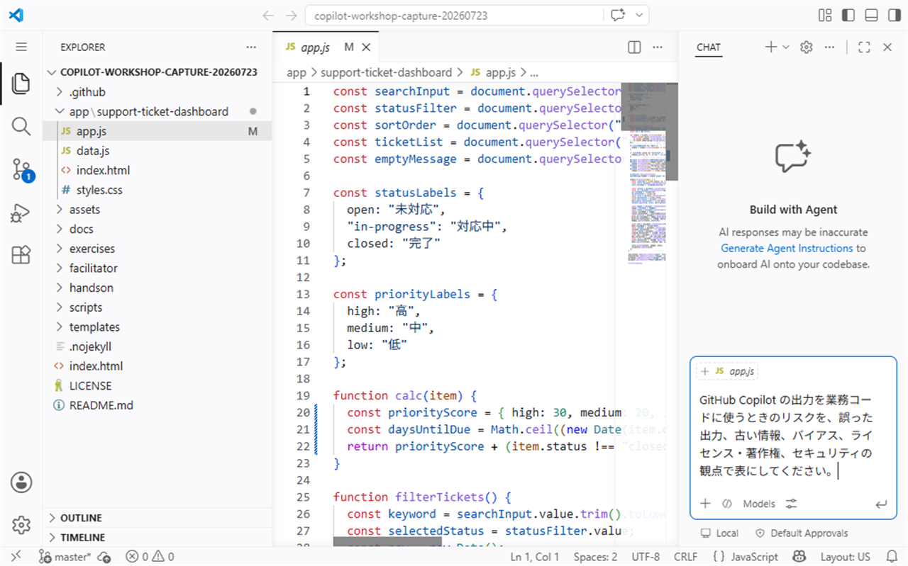

# S6: Responsible AI、検証、プライバシー、セーフガード

このハンズオンでは、GitHub Copilot を安全かつ適切に使うための考え方を整理します。Copilot は開発を助けるツールですが、生成された内容をそのまま正解として扱わず、人間が検証することが前提です。

| 項目 | 内容 |
| --- | --- |
| 時間 | 30分 |
| 目的 | Copilot の出力を職場で安全に扱うための確認観点を説明できる |
| Learn alignment | Use GitHub Copilot responsibly / data and architecture / privacy and safeguards |
| 主に扱う設定 | Suggestions matching public code, content exclusions, IDE settings |

## このハンズオンのゴール

- Copilot の出力に含まれるリスクを説明できる
- public code match と duplicate detection の考え方を理解する
- content exclusions の設定スコープと継承関係を説明できる
- チームで使う「AI 出力は人間がレビューし、検証する」というルールを作る

Responsible AI は、AI を便利に使うだけでなく、誤り、偏り、権利、セキュリティ、プライバシーへの影響を考えて使う姿勢です。

## 1. Copilot 出力のリスクを確認する

まず、Copilot の回答や生成コードにどのようなリスクがあるかを確認します。

Copilot Chat に次のように質問します。

```text
GitHub Copilot の出力を業務コードに使うときのリスクを、開発者向けに説明してください。
特に、誤った出力、古い情報、バイアス、ライセンスや著作権、セキュリティの観点を含めてください。
```

> **画面例:** Copilot 出力のリスクを5つの観点で表にする依頼を、送信前に確認する画面


回答を読み、次の表に沿って自分の言葉で整理します。

| リスク | 何が起きるか | 人間が確認すること |
| --- | --- | --- |
| 誤った出力 | 動かないコードや仕様と違う処理が生成される | テスト、実行結果、仕様との差分を確認する |
| 古い情報 | 廃止された API や古い書き方が提案される | 公式ドキュメントや既存コードの書き方と照合する |
| バイアス | 一部の前提に偏った説明や例が出る | 利用者、地域、言語、業務ルールに合うか確認する |
| ライセンス・著作権 | 既存コードに似た出力や権利上扱いに注意が必要な内容が出る | public code match や社内ルールを確認する |
| セキュリティ | 入力検証不足、秘密情報の露出、脆弱な処理が混ざる | セキュリティレビュー、静的解析、秘密情報の確認を行う |

重要なのは、Copilot の回答が自然な文章でも、正確とは限らないことです。もっともらしさではなく、根拠で判断します。

## 2. duplicate detection / public code match を確認する

duplicate detection は、提案が公開コードと一致または近い可能性がある場合に検出するための設定や仕組みです。組織や利用プランによって画面や名称は異なる場合があります。

ここでは概念を確認します。

```text
GitHub Copilot の public code match や duplicate detection は、どのような目的の機能ですか。
業務でコード提案を受け入れる前に、開発者が何を確認すべきか説明してください。
```

確認するポイントは次のとおりです。

1. 公開コードと一致する可能性がある提案は、社内ルールに従って扱います。
2. 設定が有効かどうかは、個人だけでなく組織や管理者の方針も確認します。
3. 検出されなかった提案でも、権利や品質の確認が不要になるわけではありません。
4. 生成されたコードの出所を断定せず、必要に応じて法務・セキュリティ・管理者に確認します。

このセッションでは設定画面の細かな操作を覚えることが目的ではありません。職場で「どの設定が有効か」「提案をどうレビューするか」を確認する習慣を作ることが目的です。

## 3. content exclusions の設定スコープと継承を理解する

content exclusions は、Copilot が参照・利用してはいけない内容を除外するための設定です。機密情報、生成対象外のコード、ライセンス上扱いに注意が必要なファイルなどを守るために使います。

content exclusions は、次の管理スコープで設定します。

| スコープ | 設定する人 | GitHub 上の確認場所 | 意味 |
| --- | --- | --- | --- |
| Enterprise | Enterprise owner | Enterprise の `Copilot` > `Content exclusion` | Enterprise 内の Copilot ユーザーへ適用する除外を設定する |
| Organization | Organization owner | Organization の `Settings` > `Copilot` > `Content exclusion` | Organization から Copilot seat を割り当てられたユーザーへ適用する除外を設定する |
| Repository | Repository administrator | Repository の `Settings` > `Copilot` | そのリポジトリで除外するパスを設定する |

Repository の設定画面には、上位の Organization または Enterprise から継承した除外が表示される場合があります。継承した設定は Repository 側では編集できません。個人ユーザー向けの content exclusion 設定スコープはありません。

設定項目が表示されるかどうかは、Copilot のプラン、Organization / Enterprise のポリシー、利用者の管理権限によって異なります。表示されない場合は、Organization owner、Enterprise owner、または Repository administrator に確認します。

> [!NOTE]
> content exclusions はすべての Copilot surface で同じように動くわけではありません。GitHub Copilot CLI、Copilot coding agent、IDE の Agent mode ではサポートされないため、秘密情報をプロンプトへ貼らない基本ルールも必要です。

Copilot Chat に次のように確認します。

```text
GitHub Copilot の content exclusions について、enterprise、organization、repository の設定スコープと継承関係を説明してください。
また、除外設定が必要になりやすいファイルの例を挙げてください。
```

例として、次のような内容は除外対象を検討します。

- 秘密情報や認証情報を含む可能性があるファイル
- 顧客情報、個人情報、契約情報などを含む資料
- 社外公開できない設計書や内部仕様
- ライセンス上、生成や再利用に注意が必要なコード
- セキュリティ設定やインフラ構成の一部

除外設定の有無だけで安全性が決まるわけではありません。プロンプトに秘密情報を貼らない、生成結果に秘密情報が混ざっていないか確認する、といった基本動作も必要です。

## 4. IDE settings と入力内容を確認する

Copilot は IDE や GitHub 上の設定によって動作が変わります。職場で使う前に、少なくとも次の観点を確認します。

| 観点 | 確認すること |
| --- | --- |
| サインイン | 業務で許可された GitHub アカウントで利用しているか |
| Chat / 補完 | 利用できる機能とモードが組織方針に合っているか |
| Suggestions matching public code | 公開コードと一致する候補に関する設定や通知を確認できるか |
| content exclusions | Enterprise、Organization、Repository の除外設定と継承を理解しているか |
| 入力内容 | 秘密情報、個人情報、未公開情報をプロンプトに含めていないか |

次のような質問を Copilot に投げる前に、内容を見直します。

```text
このエラーを直して。接続文字列は ...
```

接続文字列、トークン、顧客名、個人情報などは貼り付けません。必要な場合は値をマスクし、再現に必要な最小限の情報だけを共有します。

```text
このエラーを直してください。
接続文字列は <REDACTED> に置き換えています。
エラーメッセージ、対象ファイル、再現手順は次のとおりです。
```

### 演習データの`internalMemo`を安全に扱う

`app/support-ticket-dashboard/data.js`の`internalMemo`は架空の研修データですが、社内メモを模した項目です。実データと同じつもりで扱い、具体値をCopilot Chatへ貼り付けたり、回答へ引用させたりしません。

次をコードとテストで確認します。

- [ ] `app.js`が`internalMemo`を画面へ表示していない
- [ ] `buildSearchText`が`internalMemo`を検索対象にしていない
- [ ] `npm test`が成功する

Copilotへ質問する必要がある場合は、具体値を渡さず、次のように項目名と期待する扱いだけを伝えます。

```text
internalMemoは社内限定情報を想定した項目です。
具体値は引用・要約・出力せず、画面表示と検索対象に含まれないことをコード上で確認してください。
```

## 5. チームルールを作る

最後に、チームで使う短いルールを作ります。ルールは長すぎると使われなくなるため、日々のレビューで確認できる表現にします。

次の文を出発点にしてください。

```text
AI が生成したコード、テスト、ドキュメントは、人間が仕様、差分、実行結果、権利、セキュリティの観点でレビューし、検証してから採用する。
```

チームで1つ、追加ルールを作ります。

| 追加ルールの例 | 目的 |
| --- | --- |
| 秘密情報や個人情報をプロンプトに貼らない | 情報漏えいを防ぐ |
| 生成コードは必ず差分で確認する | 意図しない変更を見つける |
| テストがない場合は手動確認観点を残す | 検証できない変更を避ける |
| セキュリティに関わる変更は専門レビューを受ける | 脆弱性の混入を防ぐ |
| 出所やライセンスが気になる提案は採用前に相談する | 権利上のリスクを減らす |

### 自分たちのチームルール

> ここに、明日から使うチームルールを1つ書いてください。

## チェックポイント

このセッションの完了条件は、参加者全員が次を説明できることです。

- Copilot の出力には、誤り、古い情報、バイアス、ライセンス・著作権、セキュリティのリスクがある
- duplicate detection や public code match は役立つが、それだけで採用判断は完了しない
- content exclusions は Enterprise、Organization、Repository で設定され、上位スコープの設定が継承される
- 秘密情報、個人情報、未公開情報はプロンプトに含めない
- AI 出力は、人間がレビューし、検証してから採用する

Copilot を安全に使うための中心は、機能を無効にすることではなく、目的に合った設定、最小限の入力、差分確認、テスト、レビューを組み合わせることです。

次は [S7: まとめと次のステップ](./07-wrap-up.md) に進みます。
