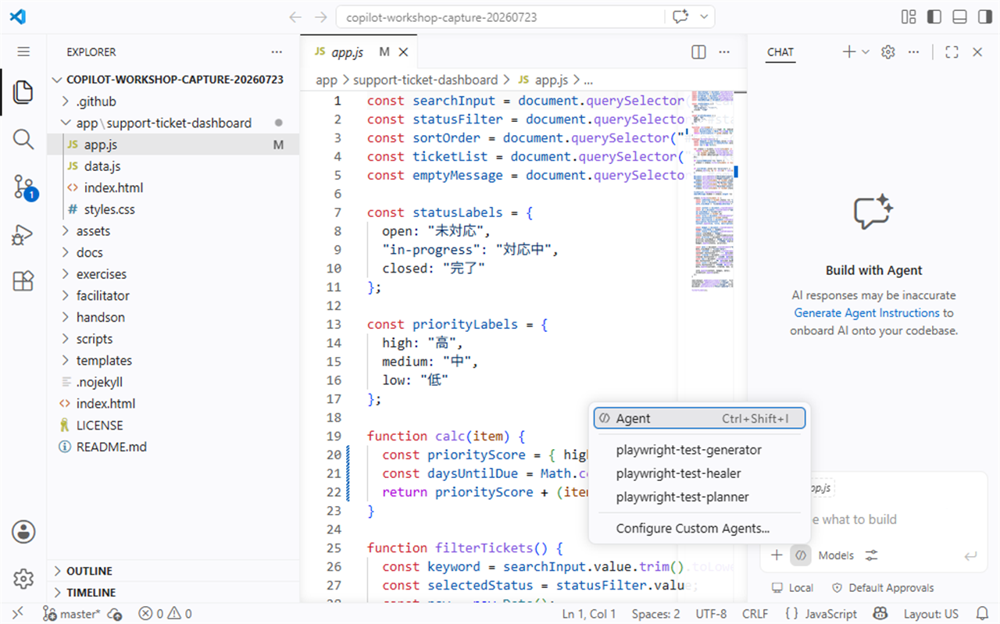

# S7: ラップアップと次の一歩

このハンズオンでは、今日使った Copilot の機能を振り返り、明日からの業務で試す行動を1つ決めます。新しい機能をすべて覚えることよりも、自分の開発作業に合わせて小さく使い始めることが目的です。

| 項目 | 内容 |
| --- | --- |
| 時間 | 15分 |
| 目的 | 学んだ内容を日々の作業に接続し、次に試すことを決める |
| 参照 | [Copilot のモード](../docs/copilot-modes.md), [プロンプト例](../templates/prompt-examples.md) |

## このハンズオンのゴール

- 今日使ったコマンドや機能から、すぐ使うものを2つ選ぶ
- 次に学ぶテーマを知る
- 「明日試すこと」を一文で書く

## 1. 今日の流れを振り返る

今日のハンズオンでは、既存コードをいきなり変更するのではなく、理解、仕様整理、テスト、リファクタリング、レビュー、Responsible AI の順に進めました。

| セッション | できるようになったこと |
| --- | --- |
| S1 | Inline suggestions と Chat の入口を使い分ける |
| S2 | 目的、対象、制約、期待結果を含むプロンプトを書く |
| S3 | Ask Mode で既存コードの構造と処理の流れを確認する |
| S4 | 仕様書と実装の差分を整理し、ドキュメントを更新する |
| S5 | テストと差分確認で守りながらリファクタリングする |
| S6 | AI 出力を人間がレビューし、検証する理由を説明する |

Copilot は、理解、計画、実装、レビューの各場面で使えます。ただし、どの場面でも最終判断は人間が行います。

## 2. 明日から使う機能を2つ選ぶ

次の中から、明日または次の開発作業ですぐ使えるものを2つ選びます。

> **画面例:** Chat の Agent picker で、標準の Agent と利用可能なカスタム Agent の入口を確認する画面


| 機能 | 使う場面 | 例 |
| --- | --- | --- |
| Ask Mode | 既存コードや仕様を理解したい | 「この関数の責務と呼び出し元を説明して」 |
| Inline Chat | 選択したコードを小さく改善したい | 「この条件分岐を読みやすくして」 |
| Smart Actions | 選択範囲から説明、修正、リファクタリングを始めたい | 関数を選択して改善案を確認する |
| `/tests` | 変更前に期待動作を固定したい | 「この関数の境界条件をテストにして」 |
| `/fix` | 警告、失敗、エラーの原因を調べたい | 「このテスト失敗の原因と最小修正を示して」 |
| Plan Mode | 変更前に影響範囲と手順を整理したい | 「まだ編集せず、実装計画を作って」 |
| Agent Mode | 計画済みの作業をまとめて進めたい | 「対象ファイルだけを変更し、検証して」 |
| Copilot Code Review | Pull Request の見落としを減らしたい | Copilot の指摘を人間が判断する |

### 自分が選ぶ2つ

1. （ここに1つ目を書く）
2. （ここに2つ目を書く）

選ぶときは、「便利そう」ではなく「次の作業で使う場面があるか」を基準にします。

## 3. コマンド・機能チートシート

このリポジトリには専用の付録ページはまだありません。ここでは最小限のチートシートをまとめます。より詳しい使い分けは [Copilot のモード](../docs/copilot-modes.md) と [プロンプト例](../templates/prompt-examples.md) を参照してください。

| やりたいこと | 使う機能 | 依頼例 |
| --- | --- | --- |
| コードを理解したい | Ask Mode | `このファイルの主要な責務とデータの流れを説明してください。` |
| 変更前に計画したい | Plan Mode | `まだ編集せず、対象ファイル、手順、検証方法を計画してください。` |
| 小さく直したい | Inline Chat | `選択した関数の命名を分かりやすくしてください。動作は変えないでください。` |
| テストを作りたい | `/tests` | `/tests この関数の正常系と境界条件のテストを作成してください。` |
| エラーを直したい | `/fix` | `/fix この失敗の原因を説明し、最小限の修正案を示してください。` |
| 差分を確認したい | Git / Review | `git diff` を読み、目的外の変更がないか確認する |
| レビュー観点を増やしたい | Copilot Code Review | Copilot の指摘を仕様、差分、動作で検証する |
| 安全に使いたい | Responsible AI | 秘密情報を貼らず、AI 出力を人間がレビューする |

プロンプトに迷ったら、次の4点を入れると回答の質が安定します。

1. 目的: 何をしたいか
2. 対象: どのファイルや関数を見るか
3. 制約: 何を変更してはいけないか
4. 完了条件: 何を確認できたら終わりか

## 4. 次に学ぶテーマを確認する

今日の内容に慣れてきたら、次のテーマに進みます。

| 次のテーマ | 何を学ぶか |
| --- | --- |
| Agent Mode | 複数ファイルの変更、検証、修正を計画に沿って進める |
| GitHub Copilot CLI | ターミナルから調査、計画、実装支援を行う |
| MCP | 外部ツールやデータソースと Copilot をつなぐ考え方を学ぶ |
| Code review | Pull Request の差分を読み、AI の指摘を人間が判断する |
| GH-300 certification | GitHub Copilot の利用、責任ある AI、開発支援の知識を体系的に確認する |

すべてを一度に始める必要はありません。最初は、既存コードの理解と小さなリファクタリングに Copilot を使うところから始めます。

## 5. 「明日試すこと」を一文で書く

最後に、明日または次の作業で試すことを一文で書きます。

```text
私は明日、＿＿＿＿の作業で、＿＿＿＿を使い、＿＿＿＿を確認してから採用します。
```

記入例:

```text
私は明日、既存バグの調査で、Ask Mode を使い、回答に出た関数名と呼び出し元を自分で確認してから採用します。
```

```text
私は明日、検索処理のリファクタリングで、/tests を使い、変更前後のテスト結果と差分を確認してから採用します。
```

### 自分の一文

> ここに「明日試すこと」を一文で書いてください。

## 完了条件

このセッションは、次を満たしたら完了です。

- 明日から使う Copilot の機能を2つ選んだ
- Agent Mode、Copilot CLI、MCP、code review、GH-300 certification が次の学習テーマとしてあることを理解した
- 「明日試すこと」を一文で書いた
- AI 出力は人間がレビューし、検証してから採用することを再確認した

今日のゴールは、Copilot にすべてを任せることではありません。既存コードを理解し、仕様とテストで守り、差分を確認しながら、日々の作業を少しずつ安全に速くすることです。
