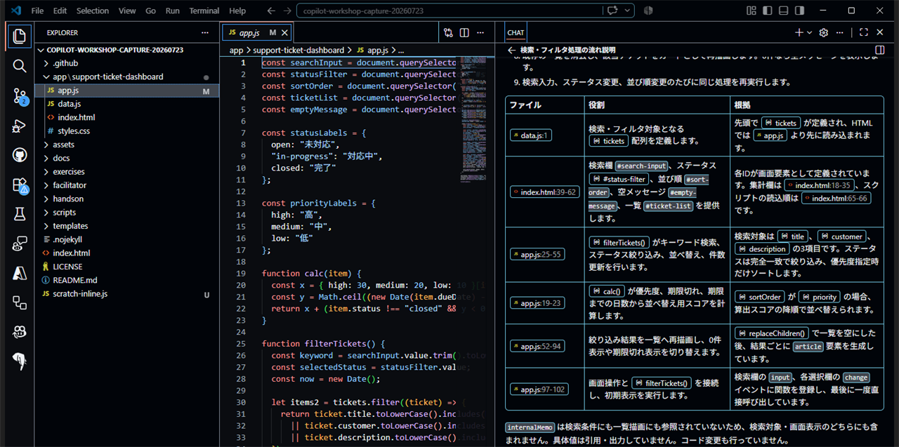

# Q1: 既存コードをGitHub Copilotで理解する

**Time: 15 min**

## ゴール

変更を始める前に、アプリの入口、主要ファイルの責務、検索・絞り込みの流れを把握します。

## 1. 画面と主要ファイルを確認する

起動済みのDashboardをブラウザーで確認し、次のファイルをエディターで開きます。

| ファイル | 確認すること |
| --- | --- |
| `index.html` | 画面要素とJavaScriptの読み込み順 |
| `data.js` | チケットデータの項目 |
| `app.js` | 検索、絞り込み、並び替え、描画 |
| `docs/app-spec.md` | 期待される画面と動作 |

## 2. リポジトリ全体の関係を質問する

```text
@workspace Support Ticket Dashboardが表示されるまでの流れを説明してください。
index.html、data.js、app.js、docs/app-spec.mdを対象に、
「ファイル」「役割」「次に渡すデータ」の3列の表で回答してください。
internalMemoの具体値は引用・要約・出力せず、項目名と扱いだけを確認してください。
まだコードは変更せず、推測と確認できた事実を分けてください。
```



## 3. `filterTickets`へ範囲を絞る

`app.js`の`filterTickets`関数を選択し、Inline Chatで質問します。

```text
/explain この関数を、入力、検索、ステータス絞り込み、並び替え、件数更新、描画の順に説明してください。
検索では、入力値を検索用に整える処理と、検索対象にしているチケット項目を明示してください。
各説明に対応するコードを示してください。
```

## 4. 回答を照合する

- [ ] 入力値を検索用に整える箇所を確認した
- [ ] 検索対象になっているチケット項目を確認した
- [ ] ステータス絞り込みの条件を確認した
- [ ] 優先度順で`calc`が使われる箇所を確認した
- [ ] DOMを更新する箇所を確認した

## 完了条件

- [ ] 主要4ファイルの役割を説明できる
- [ ] `filterTickets`の処理順を説明できる
- [ ] Copilotの説明と実コードが一致することを確認した
