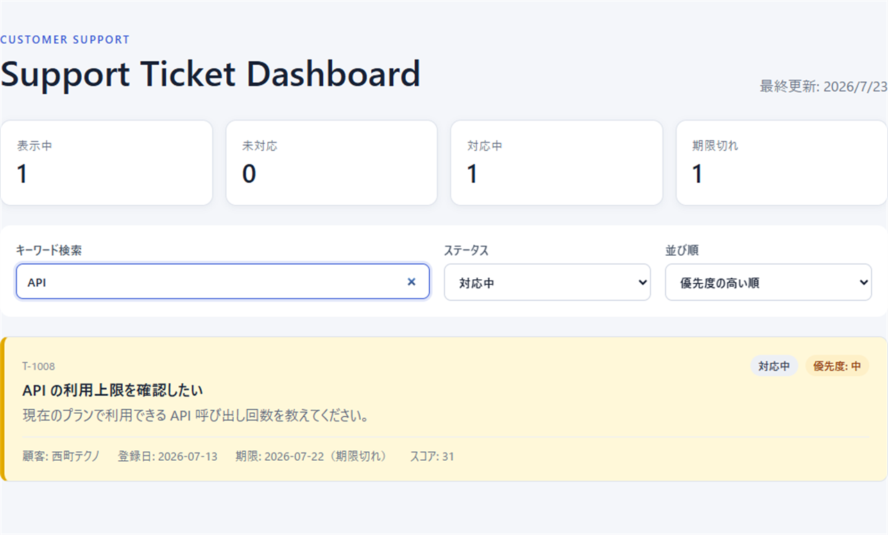
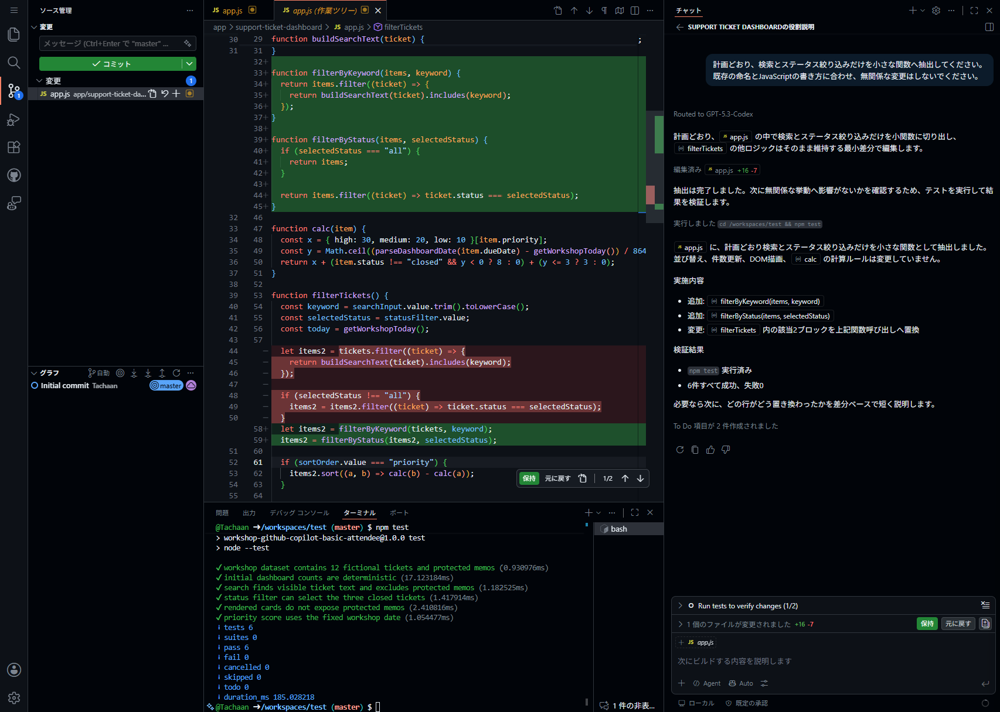

# Q3: 既存コードを安全にリファクタリングする

**Time: 15 min**

## ゴール

変更前の動作を確認し、`filterTickets`の検索・ステータス絞り込みだけを小さく分離して、動作が変わっていないことを確認します。

## 1. 変更前の動作を確認する

変更を始める前に作業ブランチを確認します。講師から指定されたブランチがない場合は、演習専用ブランチを作成します。

```bash
git branch --show-current
git switch -c workshop/copilot-practice
```

同名のブランチを作成済みの場合は、`git switch workshop/copilot-practice`で切り替えます。

最初に、自動テストがすべて成功することを確認します。

```bash
npm test
```

起動済みのDashboardで次を確認します。

| 操作 | 期待する確認結果 |
| --- | --- |
| 初期状態（検索欄は空、ステータスは`すべて`） | 表示中が12件 |
| 初期状態から`API`で検索 | 1件が表示される |
| 初期状態からステータスを`対応中`にする | 4件が表示される |
| 初期状態から一致しない語で検索 | 0件と空表示メッセージ |

> [!IMPORTANT]
> 4行はそれぞれ独立した確認です。前の行の検索語やステータスを残したまま組み合わせず、各行の前に検索欄、ステータス、並び順を初期状態へ戻します。



## 2. 小さな変更計画を作る

この後は、`tests` → `refactor` → `diff review` → `rerun tests`の順番で進めます。手順1が`tests`にあたり、ここから`refactor`に入ります。

`filterTickets`を選択して、次を依頼します。

```text
この関数の検索とステータス絞り込みを、純粋関数へ抽出する計画を作ってください。
並び替え、件数更新、DOM描画、calcの計算ルールは変更しません。
現在の検索対象と空文字の挙動を維持してください。
まず変更箇所、維持する挙動、確認手順だけを示し、まだ編集しないでください。
```

計画が範囲を超えていないことを確認したら、続けて依頼して実際に編集させます。計画のまま終わらせず、ここで必ずコードを変更します。

```text
計画どおり、検索とステータス絞り込みだけを小さな関数へ抽出してください。
既存の命名とJavaScriptの書き方に合わせ、無関係な変更はしないでください。
```

## 3. 差分をレビューする

```bash
git status --short
git diff -- app/support-ticket-dashboard/app.js tests/dashboard.test.js
```

- [ ] 検索対象の項目が変わっていない
- [ ] ステータス`all`の挙動が変わっていない
- [ ] 並び替えと`calc`が変更されていない
- [ ] DOM描画が変更されていない
- [ ] 変更理由を説明できない差分がない



`filterByKeyword`と`filterByStatus`へ抽出され、`filterTickets`の残りの処理が変わっていないことを差分で確認します。

## 4. 動作を再確認する

自動テストを再実行します。

```bash
npm test
```

続けて変更前と同じ4操作を、それぞれ初期状態から繰り返します。結果が違う場合は、そのまま採用せず差分を戻すか、原因を調べます。

> [!TIP]
> リファクタリングでは、コードが短くなったかより、外から見える動作を維持できたかが重要です。

## 完了条件

- [ ] 対象を絞ってリファクタリングした
- [ ] `tests` → `refactor` → `diff review` → `rerun tests`の順番で進めた
- [ ] 変更前後で`npm test`が成功した
- [ ] 変更前後で同じ4操作を独立して確認した
- [ ] 差分を確認した
